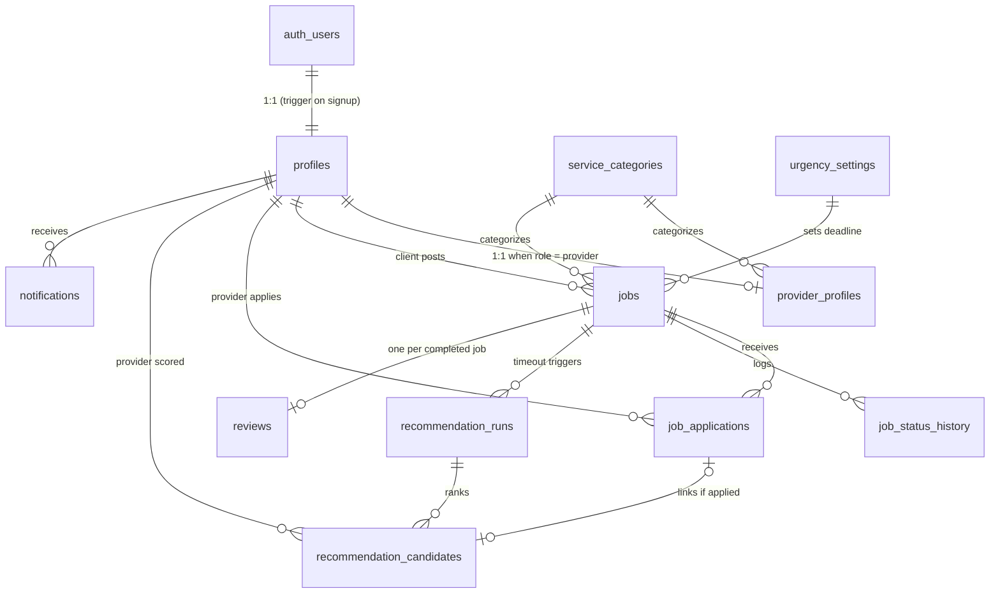

# TaskBuddy — Backend Data Schema Specification

> **Purpose of this document:** This is the authoritative data schema and recommendation-system
> specification for the TaskBuddy backend. It is written to be used directly as the prompt/basis
> for building the backend that serves the TaskBuddy **mobile app and website**.
> Follow it as the source of truth for table structure, naming, lifecycle rules, and
> ML-feature computation. Anything listed under *Out of Scope* must NOT be invented or added.

**Target platform:** Supabase (PostgreSQL 15+, Supabase Auth, Row Level Security, pg_cron)
**Companion service:** a small Python (FastAPI) service that hosts the trained scikit-learn
recommendation model (see [Recommendation Engine Integration](#9-recommendation-engine-integration)).

---

## Table of Contents

1. [Product Context](#1-product-context)
2. [The Matching Flow](#2-the-matching-flow)
3. [Schema Conventions](#3-schema-conventions)
4. [Enumerated Types](#4-enumerated-types)
5. [Tables (DDL)](#5-tables-ddl)
6. [Entity-Relationship Diagram](#6-entity-relationship-diagram)
7. [Job Lifecycle & Urgency Timeouts](#7-job-lifecycle--urgency-timeouts)
8. [ML Feature Mapping](#8-ml-feature-mapping)
9. [Recommendation Engine Integration](#9-recommendation-engine-integration)
10. [Triggers & Functions](#10-triggers--functions)
11. [Row Level Security Outline](#11-row-level-security-outline)
12. [Seed Data](#12-seed-data)
13. [Retraining Data Export](#13-retraining-data-export)
14. [Out of Scope](#14-out-of-scope)
15. [App-Support Subsystems (migration 0006)](#15-app-support-subsystems-migration-0006)
16. [Job Pricing, Scheduling & Photos (migration 0007)](#16-job-pricing-scheduling--photos-migration-0007)
17. [Provider Verification (migration 0008)](#17-provider-verification-migration-0008)
18. [Escrow & Disputes (migrations 0009-0010)](#18-escrow--disputes-migrations-0009-0010)
19. [Avatars & User Settings (migration 0011)](#19-avatars--user-settings-migration-0011)
20. [Push Notifications (migration 0012)](#20-push-notifications-migration-0012)
21. [Stripe Payments & Identity (migration 0013)](#21-stripe-payments--identity-migration-0013)
22. [Password Reset](#22-password-reset)
23. [Admin Console Follow-ups (migration 0014)](#23-admin-console-follow-ups-migration-0014)

---

## 1. Product Context

TaskBuddy is a Philippine home-services marketplace. **Clients** post jobs in five service
categories — Plumbing, Cleaning, Handyman, Manicure, Pedicure — and **providers** (freelance
service workers) apply to them. Job descriptions and provider bios are written in
Taglish (mixed Filipino/English).

The differentiating feature is an **ML recommendation engine**: a trained Random Forest
classifier (scikit-learn) that scores job–provider pairs by hiring likelihood. It was developed
and validated in the companion ML repository ("TaskBuddy ML"): winner = Random Forest with
`n_estimators=50, max_depth=10, max_features='sqrt', min_samples_split=5, class_weight='balanced'`,
0.8123 accuracy / 0.8827 ROC-AUC over 100 group-aware splits.

The model consumes **14 raw input features** per job–provider pair (listed in
[Section 8](#8-ml-feature-mapping)). All preprocessing (ordinal encoding, TF-IDF + SVD for the
two text features, scaling) happens **inside the persisted sklearn Pipeline** — the backend must
pass raw values with the exact column names and types shown in Section 8, never pre-encoded values.

This schema has two jobs:

1. **Serve the marketplace flow** (accounts, job posting, applications, hiring, reviews).
2. **Serve the recommendation system**: compute all 14 model features from live data at scoring
   time, and snapshot every scored candidate with its eventual outcome so production data
   accumulates as future retraining rows.

---

## 2. The Matching Flow

This is the exact product flow the schema must support:

1. A client posts a job (category, Taglish description, location, urgency level).
2. Providers browse open jobs and **apply organically**. The client may approve **exactly one**
   provider at any time.
3. If the job has no approved provider when its **urgency timeout** elapses
   (**urgent = 5 min, normal = 10 min, flexible = 15 min** after posting), the system triggers
   the **recommendation engine**:
   - The engine builds the eligible provider pool, computes the 14 features for each
     job–provider pair, scores them with the model, and stores the ranked results.
   - The **top-N providers (default N = 8)** each receive a notification inviting them to the job.
4. Recommended providers may then apply like any other applicant; the client still approves
   exactly one.
5. When the client approves an application, the job is assigned; it then progresses to
   completion, after which the client leaves a rating/review.

---

## 3. Schema Conventions

- **Primary keys:** `uuid` with `default gen_random_uuid()`, except small lookup/config tables.
- **Timestamps:** always `timestamptz`. Every table has `created_at timestamptz not null default now()`;
  mutable tables also have `updated_at` maintained by trigger.
- **Naming:** `snake_case` tables and columns; singular enum type names; `fk_`-free natural names.
- **Time zone:** business-facing time derivations (`hour_posted`, `day_of_week`) use `Asia/Manila`.
- **Locations:** plain `latitude double precision` / `longitude double precision` columns plus a
  haversine SQL function (Section 10). PostGIS is an optional upgrade, not required.
- **Category strings** stored in `service_categories.name` must exactly match the strings the
  model was trained on: `Plumbing`, `Cleaning`, `Handyman`, `Manicure`, `Pedicure` (case-sensitive).
- **User-generated text limits** — enforced by CHECK constraints in the DDL (characters), with
  the word figures as frontend form guidance. The two ML text features get both a floor and a
  cap: the TF-IDF pipeline was trained on short templated Taglish text, so near-empty text gives
  the model no signal and very long text dilutes it.

  | Column | Characters | ≈ Words | ML feature? |
  |---|---|---|---|
  | `jobs.title` | 5–120 | 1–15 | no |
  | `jobs.description` | 20–750 | 5–100 | **yes** (`job_description`) |
  | `provider_profiles.bio` | 20–400 | 5–60 | **yes** (`provider_bio`) |
  | `job_applications.cover_message` | ≤ 300 | ≤ 40 | no |
  | `reviews.comment` | ≤ 500 | ≤ 70 | no |

---

## 4. Enumerated Types

```sql
create type user_role          as enum ('client', 'provider');
create type job_urgency        as enum ('urgent', 'normal', 'flexible');
create type job_status         as enum ('open', 'recommending', 'assigned',
                                        'in_progress', 'completed', 'cancelled', 'expired');
-- migration 0018 adds 'confirmed' after 'assigned' — the provider's answer to
-- a booking request. See §26.1.
create type application_status as enum ('pending', 'accepted', 'rejected', 'withdrawn');
create type application_source as enum ('organic', 'recommended');
create type recommendation_trigger as enum ('timeout', 'manual');
create type notification_type  as enum ('recommendation_invite', 'application_update', 'job_update');
```

> Note: the enum labels `urgent | normal | flexible` must match the model's training values
> for the `job_urgency` feature exactly (lowercase).

> **Later migrations extend two of these**, and the block above shows the original 0001 values only:
> `user_role` gains `'admin'` (0005); `notification_type` gains `'verification_update'` (0008),
> `'dispute_update'` (0009) and `'payment_update'` (0013). Migrations 0006, 0008, 0009, 0012 and
> 0013 also add their own enums —
> `wallet_txn_direction`, `wallet_txn_status`, `booking_status` (§15); `verification_status` (§17);
> `escrow_status`, `dispute_status`, `dispute_resolution` (§18); `wallet_txn_kind` (0010, §18);
> `device_platform` (§20); `verification_method` (§21).

---

## 5. Tables (DDL)

### 5.1 `profiles` — shared identity for both roles

One row per authenticated user, `id` = Supabase `auth.users.id`. Created automatically by
trigger on signup (Section 10).

```sql
create table profiles (
    id           uuid primary key references auth.users (id) on delete cascade,
    role         user_role not null,
    full_name    text not null,
    phone        text,
    avatar_url   text,                       -- Supabase Storage public URL
    address      text,
    city         text,
    latitude     double precision,           -- default location; jobs carry their own coords
    longitude    double precision,
    deactivated_at timestamptz,              -- soft delete / suspension
    created_at   timestamptz not null default now(),
    updated_at   timestamptz not null default now()
);
```

### 5.2 `service_categories` — lookup

```sql
create table service_categories (
    id         smallint generated always as identity primary key,
    name       text not null unique,         -- must match ML training strings exactly
    is_active  boolean not null default true,
    created_at timestamptz not null default now()
);
```

### 5.3 `provider_profiles` — provider-only attributes + cached ML stats

1:1 extension of `profiles` for `role = 'provider'`. The three `cached_*` columns are
denormalized aggregates maintained by triggers (Section 10) so recommendation scoring never
needs expensive on-the-fly aggregation.

```sql
create table provider_profiles (
    profile_id    uuid primary key references profiles (id) on delete cascade,
    category_id   smallint not null references service_categories (id),
    bio           text not null
                  check (char_length(bio) between 20 and 400),  -- Taglish self-description (ML feature: provider_bio)
    years_experience numeric(4,1) not null default 0,
    is_available  boolean not null default true, -- provider-controlled toggle (ML feature)
    service_radius_km numeric(5,1) not null default 15.0,
    cached_avg_rating        numeric(3,2),       -- null until first review
    cached_ratings_count     integer not null default 0,
    cached_completed_jobs    integer not null default 0,
    cached_avg_response_hrs  numeric(6,2),       -- null until first responded invite
    created_at    timestamptz not null default now(),
    updated_at    timestamptz not null default now()
);

create index idx_provider_profiles_category   on provider_profiles (category_id);
create index idx_provider_profiles_available  on provider_profiles (is_available) where is_available;
```

### 5.4 `urgency_settings` — recommendation timeout config

```sql
create table urgency_settings (
    urgency         job_urgency primary key,
    timeout_minutes integer not null check (timeout_minutes > 0)
);
```

Seeded with: `urgent = 5`, `normal = 10`, `flexible = 15` (Section 12).

### 5.5 `jobs`

```sql
create table jobs (
    id           uuid primary key default gen_random_uuid(),
    client_id    uuid not null references profiles (id),
    category_id  smallint not null references service_categories (id),
    title        text not null check (char_length(title) between 5 and 120),
    description  text not null
                 check (char_length(description) between 20 and 750),  -- Taglish (ML feature: job_description)
    urgency      job_urgency not null default 'normal',
    status       job_status not null default 'open',
    address      text not null,
    latitude     double precision not null,
    longitude    double precision not null,
    posted_at    timestamptz not null default now(),
    recommendation_deadline timestamptz not null,  -- set by trigger: posted_at + urgency timeout
    assigned_provider_id uuid references profiles (id),
    assigned_at  timestamptz,
    completed_at timestamptz,
    created_at   timestamptz not null default now(),
    updated_at   timestamptz not null default now(),
    constraint chk_assignment_consistency
        check (status not in ('assigned','in_progress','completed') or assigned_provider_id is not null)
);

create index idx_jobs_status_deadline on jobs (status, recommendation_deadline)
    where status = 'open';                    -- the timeout poller's index
create index idx_jobs_client   on jobs (client_id);
create index idx_jobs_category on jobs (category_id, status);
```

### 5.6 `job_status_history` — audit trail of lifecycle transitions

```sql
create table job_status_history (
    id         bigint generated always as identity primary key,
    job_id     uuid not null references jobs (id) on delete cascade,
    old_status job_status,
    new_status job_status not null,
    changed_by uuid references profiles (id),  -- null when system-initiated
    changed_at timestamptz not null default now()
);

create index idx_job_status_history_job on job_status_history (job_id, changed_at);
```

### 5.7 `job_applications`

```sql
create table job_applications (
    id          uuid primary key default gen_random_uuid(),
    job_id      uuid not null references jobs (id) on delete cascade,
    provider_id uuid not null references profiles (id),
    source      application_source not null default 'organic',
    status      application_status not null default 'pending',
    cover_message text check (char_length(cover_message) <= 300),
    applied_at  timestamptz not null default now(),
    decided_at  timestamptz,                  -- when client accepted/rejected
    created_at  timestamptz not null default now(),
    updated_at  timestamptz not null default now(),
    unique (job_id, provider_id)
);

-- Exactly ONE accepted application per job — the core marketplace invariant.
create unique index uq_job_applications_one_accepted
    on job_applications (job_id) where status = 'accepted';

create index idx_job_applications_provider on job_applications (provider_id, status);
```

### 5.8 `recommendation_runs` — one row per scoring event

```sql
create table recommendation_runs (
    id            uuid primary key default gen_random_uuid(),
    job_id        uuid not null references jobs (id) on delete cascade,
    triggered_by  recommendation_trigger not null default 'timeout',
    model_version text not null,              -- e.g. 'rf-a-v1' — set by the model service
    pool_size     integer not null,           -- eligible providers considered
    created_at    timestamptz not null default now()
);

create index idx_recommendation_runs_job on recommendation_runs (job_id);
```

### 5.9 `recommendation_candidates` — ranked results + frozen feature snapshot

This table is the heart of the recommendation system. Each row stores the model's output for
one job–provider pair **and the exact 14 feature values at scoring time** (column names match
the ML training dataset). `was_hired` is backfilled when the job closes, turning every row
into a labeled retraining example.

```sql
create table recommendation_candidates (
    id          uuid primary key default gen_random_uuid(),
    run_id      uuid not null references recommendation_runs (id) on delete cascade,
    provider_id uuid not null references profiles (id),
    rank        smallint not null,            -- 1 = best
    score       numeric(6,5) not null,        -- model probability of hire
    notified_at timestamptz,                  -- set when invite notification is created (top-N only)
    application_id uuid references job_applications (id),  -- set if the provider applied
    was_hired   boolean,                      -- backfilled at job completion/cancellation

    -- Frozen ML feature snapshot (names/types mirror the training CSV) --
    skills_match                smallint not null,          -- 0/1
    distance_km                 numeric(6,2) not null,
    provider_avg_rating         numeric(3,2) not null,
    provider_completed_jobs     integer not null,
    provider_availability       smallint not null,          -- 0/1
    job_idle_duration_hrs       numeric(8,2) not null,
    provider_response_time_hrs  numeric(6,2) not null,
    provider_years_experience   numeric(4,1) not null,
    hour_posted                 smallint not null,
    provider_skill_category     text not null,
    day_of_week                 text not null,
    job_urgency                 text not null,
    job_description             text not null,
    provider_bio                text not null,

    created_at  timestamptz not null default now(),
    unique (run_id, provider_id)
);

create index idx_recommendation_candidates_provider on recommendation_candidates (provider_id);
create index idx_recommendation_candidates_label
    on recommendation_candidates (was_hired) where was_hired is not null;
```

### 5.10 `reviews` — source of `provider_avg_rating`

One review per completed job, written by the job's client about the assigned provider.

```sql
create table reviews (
    id          uuid primary key default gen_random_uuid(),
    job_id      uuid not null unique references jobs (id) on delete cascade,
    client_id   uuid not null references profiles (id),
    provider_id uuid not null references profiles (id),
    rating      smallint not null check (rating between 1 and 5),
    comment     text check (char_length(comment) <= 500),
    created_at  timestamptz not null default now()
);

create index idx_reviews_provider on reviews (provider_id);
```

### 5.11 `notifications` — minimal, scoped to this flow

```sql
create table notifications (
    id           uuid primary key default gen_random_uuid(),
    recipient_id uuid not null references profiles (id) on delete cascade,
    type         notification_type not null,
    title        text not null,
    body         text not null,
    data         jsonb not null default '{}',  -- { "job_id": ..., "application_id": ... }
    read_at      timestamptz,
    created_at   timestamptz not null default now()
);

create index idx_notifications_recipient on notifications (recipient_id, read_at, created_at desc);
```

---

## 6. Entity-Relationship Diagram



---

## 7. Job Lifecycle & Urgency Timeouts

```
                    client approves an application
   open ────────────────────────────────────────────► assigned ──► in_progress ──► completed
    │                                                     ▲                            │
    │ recommendation_deadline passes                      │                            ▼
    │ with no accepted application                        │                     (review written)
    ▼                                                     │
 recommending ── top-N providers notified; they apply ────┘
    │
    │ no acceptance within 24 h of posting (tunable constant)
    ▼
 expired                    (client may cancel from any pre-completion state ──► cancelled)
```

Rules:

- `recommendation_deadline = posted_at + timeout_minutes(urgency)` from `urgency_settings`:
  **urgent = 5 min, normal = 10 min, flexible = 15 min**. Set by trigger on insert (Section 10).
- A pg_cron job runs **every minute** and transitions `open → recommending` for jobs past their
  deadline with no accepted application, then invokes the recommendation service (Section 9).
- The `open → recommending` transition happens at most once per job via the timeout path;
  additional runs are only possible with `triggered_by = 'manual'`.
- Accepting an application (from either an `open` or `recommending` job) sets
  `jobs.assigned_provider_id`, `assigned_at`, `status = 'assigned'`, and auto-rejects all other
  pending applications for that job.
- The assigned provider then either accepts (`assigned → confirmed`) or declines with a reason
  (`→ cancelled`, escrow refunded) — see §26.1. Starting work is allowed from either
  `assigned` or `confirmed`.
- Every status change is recorded in `job_status_history` by trigger.
- On terminal states (`completed`, `cancelled`, `expired`), backfill
  `recommendation_candidates.was_hired` for all candidates of that job:
  `true` where the candidate's provider is the assigned provider of a completed job, else `false`.

---

## 8. ML Feature Mapping

The model service must receive, for each job–provider pair, a record with **exactly these
14 columns** (names and raw types as trained; the sklearn Pipeline does all encoding internally):

| # | Feature (exact column name) | Type | Live source |
|---|---|---|---|
| 1 | `skills_match` | int 0/1 | `provider_profiles.category_id = jobs.category_id` |
| 2 | `distance_km` | float | `haversine_km(jobs.latitude, jobs.longitude, profiles.latitude, profiles.longitude)` |
| 3 | `provider_avg_rating` | float | `provider_profiles.cached_avg_rating`; fallback **3.0** when null (new provider) |
| 4 | `provider_completed_jobs` | int | `provider_profiles.cached_completed_jobs` |
| 5 | `provider_availability` | int 0/1 | `provider_profiles.is_available` |
| 6 | `job_idle_duration_hrs` | float | `extract(epoch from (now() - jobs.posted_at)) / 3600` at scoring time |
| 7 | `provider_response_time_hrs` | float | `provider_profiles.cached_avg_response_hrs`; fallback **2.0** when null |
| 8 | `provider_years_experience` | float | `provider_profiles.years_experience` |
| 9 | `hour_posted` | int | `extract(hour from jobs.posted_at at time zone 'Asia/Manila')` |
| 10 | `provider_skill_category` | text | `service_categories.name` of the provider's category |
| 11 | `day_of_week` | text | `trim(to_char(jobs.posted_at at time zone 'Asia/Manila', 'Day'))` → `'Monday'`…`'Sunday'` |
| 12 | `job_urgency` | text | `jobs.urgency::text` (`'urgent' / 'normal' / 'flexible'`) |
| 13 | `job_description` | text | `jobs.description` |
| 14 | `provider_bio` | text | `provider_profiles.bio` |

Definitions the backend must implement:

- **`cached_avg_response_hrs`** = average of
  `extract(epoch from (application.applied_at - candidate.notified_at)) / 3600`
  over the provider's **last 20 responded recommendation invites**
  (rows in `recommendation_candidates` where `notified_at` and `application_id` are both set).
  Recomputed by trigger whenever such a link is created. Invites the provider ignored are
  excluded. New providers have `null` → the scoring query substitutes the fallback **2.0 h**.
- **Fallback values** (3.0 rating, 2.0 h response) are tunable constants; keep them in the model
  service's config, not hardcoded in SQL scattered across the codebase.
- **Eligible provider pool** for a scoring run: providers with `is_available = true`,
  `deactivated_at is null`, who have not already applied to the job, and whose category matches
  the job **or** whose distance to the job is within their `service_radius_km`. `pool_size` on
  `recommendation_runs` records how many were scored.

### Feature-vector SQL function

Implement a function the model service calls per scoring run:

```sql
create or replace function fn_job_provider_features(p_job_id uuid)
returns table (
    provider_id uuid,
    skills_match smallint,
    distance_km numeric,
    provider_avg_rating numeric,
    provider_completed_jobs integer,
    provider_availability smallint,
    job_idle_duration_hrs numeric,
    provider_response_time_hrs numeric,
    provider_years_experience numeric,
    hour_posted smallint,
    provider_skill_category text,
    day_of_week text,
    job_urgency text,
    job_description text,
    provider_bio text
)
language sql stable as $$
    select
        pp.profile_id,
        (pp.category_id = j.category_id)::int::smallint,
        round(haversine_km(j.latitude, j.longitude, pr.latitude, pr.longitude)::numeric, 2),
        coalesce(pp.cached_avg_rating, 3.0),
        pp.cached_completed_jobs,
        pp.is_available::int::smallint,
        round((extract(epoch from (now() - j.posted_at)) / 3600)::numeric, 2),
        coalesce(pp.cached_avg_response_hrs, 2.0),
        pp.years_experience,
        extract(hour from j.posted_at at time zone 'Asia/Manila')::smallint,
        sc.name,
        trim(to_char(j.posted_at at time zone 'Asia/Manila', 'Day')),
        j.urgency::text,
        j.description,
        pp.bio
    from jobs j
    cross join provider_profiles pp
    join profiles pr on pr.id = pp.profile_id
    join service_categories sc on sc.id = pp.category_id
    where j.id = p_job_id
      and pp.is_available
      and pr.deactivated_at is null
      and pr.latitude is not null and pr.longitude is not null  -- providers without a location can't be scored
      and not exists (select 1 from job_applications ja
                      where ja.job_id = j.id and ja.provider_id = pp.profile_id)
      and (pp.category_id = j.category_id
           or haversine_km(j.latitude, j.longitude, pr.latitude, pr.longitude)
              <= pp.service_radius_km);
$$;
```

---

## 9. Recommendation Engine Integration

Supabase Edge Functions run Deno, not Python, so the sklearn model lives in a **separate
Python FastAPI service** (deploy anywhere that runs Python: Railway/Render/Fly/VPS).

**Model artifact:** the ML repository (`TaskBuddy ML`) trains and evaluates but does not persist
a model file. The backend project must produce the artifact once:
fit the winning pipeline — the shared preprocessing `ColumnTransformer` (passthrough numerics,
`OrdinalEncoder` for the 3 categoricals, per-text-column `TfidfVectorizer(sublinear_tf=True)` →
`TruncatedSVD(n_components=20, random_state=42)`) followed by
`RandomForestClassifier(n_estimators=50, max_depth=10, max_features='sqrt',
min_samples_split=5, class_weight='balanced', random_state=42)` — on the **full**
`taskbuddy_synthetic_dataset.csv` (all 40,000 rows; evaluation is already done, so no rows need
holding out — just drop the `hire_probability` audit column), and save with `joblib.dump()`.
Version it (`rf-a-v1`).
Replace with a model retrained on real data once enough labeled rows accumulate (Section 13).

**Scoring flow (per timed-out job):**

1. pg_cron (every minute) finds `open` jobs past `recommendation_deadline` with no accepted
   application, sets them to `recommending`, and notifies the model service
   (HTTP call via `pg_net`, or the service polls a queue view — implementer's choice).
2. The service calls `fn_job_provider_features(job_id)` (via Supabase service-role key or a
   direct Postgres connection), runs `pipeline.predict_proba(df)[:, 1]`, and:
   - inserts one `recommendation_runs` row (`model_version`, `pool_size`);
   - inserts one `recommendation_candidates` row **per scored provider** (full feature snapshot),
     ranked by score;
   - sets `notified_at` and creates a `notifications` row (`type = 'recommendation_invite'`)
     for the **top N = 8** only.
3. When a provider who was a candidate applies, the backend links
   `recommendation_candidates.application_id` and sets `job_applications.source = 'recommended'`.

**Column order/name discipline:** build the scoring DataFrame directly from the function's
result set — the pipeline selects columns by name, so names must match Section 8 exactly.

---

## 10. Triggers & Functions

Implement these (standard PL/pgSQL; exact bodies are the implementer's choice unless shown):

| # | Trigger / function | Behavior |
|---|---|---|
| 1 | `handle_new_user()` on `auth.users` insert | Create the `profiles` row from signup metadata (`role`, `full_name`). Supabase-standard pattern. |
| 2 | `set_updated_at()` | `before update` on every table with `updated_at`. |
| 3 | `set_recommendation_deadline()` | `before insert` on `jobs`: `recommendation_deadline := posted_at + make_interval(mins => (select timeout_minutes from urgency_settings where urgency = new.urgency))`. |
| 4 | `log_job_status_change()` | `after update of status` on `jobs`: insert into `job_status_history`. |
| 5 | `handle_application_accepted()` | `after update` on `job_applications` when status becomes `accepted`: set job's `assigned_provider_id`, `assigned_at`, `status='assigned'`; auto-reject sibling `pending` applications (set `decided_at`). |
| 6 | `refresh_provider_rating()` | `after insert` on `reviews`: recompute `cached_avg_rating` and `cached_ratings_count` for the provider. |
| 7 | `refresh_provider_completed_jobs()` | `after update` on `jobs` when status becomes `completed`: increment the assigned provider's `cached_completed_jobs`; also backfill `was_hired` on all `recommendation_candidates` of this job. Backfill `was_hired=false` on `cancelled`/`expired` too. |
| 8 | `refresh_provider_response_time()` | `after update of application_id` on `recommendation_candidates`: recompute `cached_avg_response_hrs` over the provider's last 20 responded invites. |
| 9 | `haversine_km(lat1, lon1, lat2, lon2)` | Immutable SQL function: `6371 * acos(least(1.0, cos(radians(lat1))*cos(radians(lat2))*cos(radians(lon2)-radians(lon1)) + sin(radians(lat1))*sin(radians(lat2))))`. |

---

## 11. Row Level Security Outline

Enable RLS on **every** table. Policy intent (implementer writes the SQL):

| Table | Policy intent |
|---|---|
| `profiles` | Users read/update own row. Public read of `full_name`, `avatar_url`, `city` for marketplace display (or expose via a view). |
| `service_categories`, `urgency_settings` | Read for all authenticated users; write via service role only. |
| `provider_profiles` | Provider updates own row (`bio`, `is_available`, etc. — **not** the `cached_*` columns; restrict those to trigger/service role). Authenticated users can read (needed for job browsing/display). |
| `jobs` | Client full access to own jobs. Providers read jobs with status `open`/`recommending`, plus jobs they're assigned to. |
| `job_applications` | Provider inserts/reads/withdraws own applications. Client reads applications for own jobs and updates their status (accept/reject). |
| `recommendation_runs`, `recommendation_candidates` | **Service role only.** Never client-readable — feature snapshots include other providers' data and model scores. |
| `reviews` | Client inserts for own completed jobs (one per job, enforced by unique constraint). Read for all authenticated users. |
| `notifications` | Recipient reads/marks-read own rows; inserts via service role/triggers only. |
| `job_status_history` | Read own-job history (client) / assigned-job history (provider); insert via trigger only. |

Example policy (pattern to follow):

```sql
alter table jobs enable row level security;

create policy jobs_client_all on jobs
    for all using (client_id = auth.uid());

create policy jobs_provider_read on jobs
    for select using (
        status in ('open', 'recommending')
        or assigned_provider_id = auth.uid()
    );
```

---

## 12. Seed Data

```sql
insert into service_categories (name) values
    ('Plumbing'), ('Cleaning'), ('Handyman'), ('Manicure'), ('Pedicure');

insert into urgency_settings (urgency, timeout_minutes) values
    ('urgent', 5), ('normal', 10), ('flexible', 15);
```

---

## 13. Retraining Data Export

Every closed job yields labeled rows. Export in the exact training-CSV shape:

```sql
select
    rr.job_id,
    rc.provider_id,
    rc.skills_match,
    rc.distance_km,
    rc.provider_avg_rating,
    rc.provider_completed_jobs,
    rc.provider_availability,
    rc.job_idle_duration_hrs,
    rc.provider_response_time_hrs,
    rc.provider_years_experience,
    rc.hour_posted,
    rc.provider_skill_category,
    rc.day_of_week,
    rc.job_urgency,
    rc.job_description,
    rc.provider_bio,
    rc.was_hired::int as is_recommended
from recommendation_candidates rc
join recommendation_runs rr on rr.id = rc.run_id
where rc.was_hired is not null;
```

Retraining then reuses the ML repository's `run_training.py` methodology (GroupShuffleSplit by
`job_id` — critical, candidates of one job must never straddle the train/test boundary).

> Note for whoever retrains: production rows will all have `provider_availability = 1`, because
> the scoring pool only ever contains available providers (a deliberate product rule). The
> feature stays in the vector for compatibility with the trained pipeline, but it will carry no
> variance in production-collected data.

---

## 14. Out of Scope

Do **not** design or implement the following (deliberately deferred; adding them now would
bloat the schema beyond the validated recommendation flow):

- Provider portfolios and certifications
- Multi-category providers (one category per provider for now — matches the model)
- Push-notification delivery infrastructure (the `notifications` table is the source of truth;
  delivery transport is a later concern)

> **Scope note (migration 0006):** Wallet/payments, in-app chat, and scheduling/calendar were
> originally on this list. They have since been added — as ledger/chat/booking tables that back
> the mobile app's Wallet, Chat, and Calendar screens — and are documented in [Section 15](#15-app-support-subsystems-migration-0006).
> They are **not** part of the ML recommendation flow and feed no model features. Admin
> dashboard/moderation tables were likewise added later (migration 0005).

> **Scope note (migrations 0007–0009):** *Document verification* was also on this list and has
> since been added (§17), along with job pricing/scheduling/photos (§16) and escrow/disputes
> (§18). Like §15, none of these feed model features or the retraining export. The driver was
> the same in every case: the mobile and web UIs already collected or displayed this data and
> had nowhere to put it.

---

## 15. App-Support Subsystems (migration 0006)

These three subsystems exist to back the mobile app UI. They are intentionally lightweight and
**decoupled from the recommendation engine** — none of their columns are ML features, and no
retraining export reads them. RLS is enabled on every table (the NestJS API uses the service-role
key and enforces authorization in code; policies are defense-in-depth). Full DDL lives in
`supabase/migrations/0006_wallet_chat_calendar.sql`.

### 15.1 Wallet — `wallet_transactions`

A per-user ledger. **There is no real payment gateway**; entries are recorded directly and the
balance is *derived* (never stored): `sum(completed credits) − sum(completed debits)`. Enums:
`wallet_txn_direction ('credit','debit')`, `wallet_txn_status ('pending','completed','failed')`.
`amount` is always positive; `direction` carries the sign. An optional `job_id` links a payout /
hold / refund to the job that produced it. Migration 0010 adds a `kind` column — see §18; revenue
is `kind = 'payout'`, not merely "a credit with a job_id".

- `GET /wallet` → `{ balance, total_credited, total_debited, pending, transactions[] }`
- `POST /wallet/transactions` → record `{ direction, amount, title, job_id? }`

### 15.2 Chat — `conversations` + `messages`

One conversation per job, between its `client_id` and (assigned) `provider_id`. Created lazily the
first time either participant opens it — the job must already have an assigned provider. `messages`
carry `body` (1–1000 chars) and a `read_at`; a trigger keeps `conversations.last_message_at`
current for list ordering.

- `GET /conversations` → the caller's conversations (counterpart name + last-message time)
- `POST /conversations` → get-or-create for `{ job_id }`
- `GET /conversations/:id/messages` · `POST /conversations/:id/messages` `{ body }` · `POST /conversations/:id/read`

### 15.3 Calendar — `bookings`

A provider's scheduled bookings for assigned jobs. The base marketplace treats jobs as ASAP; a
booking adds an explicit `scheduled_at` + `duration_minutes` so the calendar has something to show.
Enum `booking_status ('scheduled','completed','cancelled')`. One booking per job.

- `GET /calendar/bookings?from=&to=` → the caller's bookings (provider or client side)
- `POST /calendar/bookings` 🔒(provider) → schedule an assigned job
- `PATCH /calendar/bookings/:id` 🔒(provider) → reschedule / update status / notes

---

## 16. Job Pricing, Scheduling & Photos (migration 0007)

The mobile job-creation flow always collected a budget, a preferred date/time, and photos, but
`submitJob()` dropped them — there were no columns. The web admin console's Bookings "Amount"
column was a hardcoded placeholder for the same reason. Three additive columns on `jobs`:

| Column | Type | Notes |
|---|---|---|
| `budget` | `numeric(12,2)` null, `> 0` | Client-set, in PHP. Null on every job posted before this migration. Seeds `escrow_transactions.amount` (§18). |
| `scheduled_at` | `timestamptz` null | Client's preferred start. Null = ASAP, the pre-existing behaviour. |
| `photo_urls` | `text[]` not null default `'{}'`, ≤ 6 | Storage object **paths** in the public `job-photos` bucket — not URLs, so the bucket can be re-pointed without rewriting rows. |

**No provider bidding.** Pricing is a single client-set budget; `job_applications` carries no
amount. This matches the mobile UI and keeps the ML flow's unpriced-application assumption intact.

**Auto-booking.** `handle_application_accepted()` (originally 0002) is replaced. It still assigns
the job and auto-rejects sibling applications, and now also inserts the `bookings` row when
`jobs.scheduled_at` is set, `on conflict (job_id) do nothing`. Before this, nothing in the product
ever created a booking, so the provider calendar was permanently empty.

**Uploads.** `POST /uploads/signed-url` returns a signed Storage upload URL; the device uploads
directly. Paths are generated server-side as `<profile id>/<uuid>.<ext>` and the API rejects any
submitted path that doesn't carry the caller's prefix.

---

## 17. Provider Verification (migration 0008)

Backs backlog stories #9 (provider submits ID + selfie) and #28 (admin review queue). Documents
live in the **private** `verification-docs` bucket; admins read them through short-lived signed
URLs generated by the API. These are government IDs — never make this bucket public.

`provider_verifications`: `id`, `provider_id`, `id_document_path`, `selfie_path`,
`status verification_status ('pending','approved','rejected')`, `submitted_at`, `reviewed_at`,
`reviewed_by`, `rejection_reason` (≤500), timestamps.

- Partial unique index on `(provider_id) where status = 'pending'` — a provider may resubmit
  after a rejection, but only one review can be open at a time.
- `provider_profiles.is_verified` flips on approval.

**`is_verified` was specified as a badge, not a gate** — applying to jobs deliberately not
restricted by it, because enforcing it would lock out every provider who signed up before
verification existed.

> **⚠️ The code does not match this paragraph.** `ApplicationsService.apply` throws
> `403 Verify your identity before applying to jobs` for a provider whose `is_verified` is false
> (`applications.service.ts`, added in `381836d` without a note saying why). So verification *is*
> a gate today, on both the deployed API and this worktree.
>
> This is flagged rather than silently resolved because both readings are defensible and the fix
> is one line in whichever direction product picks — but they are not the same product. Gating
> means an unverified provider sees the job feed and cannot act on it; ungating means the badge is
> decoration and an unvetted stranger can be hired. Pick one and make the other side match: delete
> the check, or delete this paragraph and say so in `backend/README.md`'s Verifications section,
> which currently repeats the badge-not-gate wording too.

---

## 18. Escrow & Disputes (migrations 0009-0010)

`wallet_transactions` (§15.1) is a one-party ledger. The admin Transactions page needs the
opposite — a two-party record with escrow and dispute states — and the mobile dispute screen had
no backend at all. Backlog stories #17, #18, #20.

`escrow_transactions`: `id`, `job_id` (unique), `client_id`, `provider_id`, `amount numeric(12,2)`,
`status escrow_status ('held','released','disputed','refunded','cancelled')`, `held_at`,
`released_at`, `refunded_at`, timestamps.

`disputes`: `id`, `escrow_id`, `job_id`, `raised_by`, `reason` (1–200), `details` (≤1000),
`status dispute_status ('open','resolved','cancelled')`,
`resolution dispute_resolution ('released_to_provider','refunded_to_client')`, `resolution_note`,
`resolved_by`, `resolved_at`, timestamps. A CHECK keeps `status`/`resolution` consistent, and a
partial unique index on `(escrow_id) where status = 'open'` allows only one live dispute.

### Lifecycle

| Event | Escrow | Wallet movement |
|---|---|---|
| Application accepted, `jobs.budget` not null | → `held` | client **debit** (`escrow_hold`) |
| Job completed | → `released` | provider **credit** (`payout`) |
| Job cancelled | → `cancelled` | client **credit** (`refund`) |
| Client raises a dispute | → `disputed` | none — funds frozen |
| Admin resolves `released_to_provider` | → `released` | provider **credit** (`payout`) |
| Admin resolves `refunded_to_client` | → `refunded` | client **credit** (`refund`) |

Jobs with no budget get no escrow, and every step above no-ops for them.

### Funding a hold

You cannot hold money that isn't there. `POST /applications/:id/accept` therefore fails with
**400 `Insufficient wallet balance`** when the client's derived balance is below the job budget —
the job stays `open` and nobody is hired. Clients add funds through
`POST /wallet/transactions` (`direction: 'credit'`), which is what mobile's Add Money button does.

There is still no payment gateway: the ledger is the only account of record, and a top-up is
simply a recorded credit.

### `wallet_transactions.kind` — why direction isn't enough

A payout and a refund are **both credits carrying a `job_id`**. The pre-0010 revenue query
(`direction = 'credit' AND job_id IS NOT NULL`) would have counted refunds as revenue, inflating
the admin dashboard by the value of every cancelled or disputed job.

So every ledger row now carries a `wallet_txn_kind`, and **platform revenue is defined as
`kind = 'payout'`** and nothing else. The migration backfills existing job-linked credits to
`'payout'`, which is exactly what the old query counted — so revenue figures carry over unchanged.

`kind` is derived server-side and never accepted from a request body: a caller able to set
`kind = 'payout'` could inflate reported revenue just by topping up. `POST /wallet/transactions`
only ever produces `topup` or `withdrawal`; `payout`, `refund` and `escrow_hold` are written
exclusively by `EscrowService`.

### Known limitation

The balance check and the debit are two separate statements, not one transaction. Two concurrent
accepts for the same client could both pass the check and overdraw. In practice a client accepting
two jobs in the same instant is vanishingly rare, and the per-job `unique (job_id)` on
`escrow_transactions` still prevents double-holding a single job. Closing it properly means moving
hold into a SQL function with `select ... for update` — worth doing if real money is ever involved.

---

## 19. Avatars & User Settings (migration 0011)

Two gaps mobile/README.md lists under "What's Not Wired Yet".

### `avatars` Storage bucket

`profiles.avatar_url` has existed since 0001, but no bucket was registered for it, so the API
would not issue an upload URL and the app's "Change Photo" button had nowhere to put the file.
The bucket is **public**, like `job-photos` and unlike `verification-docs`: an avatar appears on
every job card and chat header, and signing each one would cost a round-trip per row.

`PATCH /profiles/me` accepts either shape in `avatar_url` and normalises both:

| Sent | Stored |
|------|--------|
| `u1/9f3c….jpg` (Storage path from `POST /uploads/signed-url`) | the bucket's public URL |
| `https://lh3.googleusercontent.com/…` (what Google sign-in supplies) | unchanged |
| `""` | `NULL` |

Paths are ownership-checked before conversion, and plaintext `http://` is rejected — otherwise a
profile could beacon every viewer to a third-party server.

### `user_settings`

One row per profile, holding the Settings screen's five toggles: `push_enabled`, `email_enabled`,
`sms_enabled`, `location_sharing`, `dark_mode`.

**A missing row means "all defaults", not "no settings".** Most users never open the screen, so
`GET /settings` creates the row on first read with no columns beyond the key — the DDL defaults
are the single definition of what a default is. `PATCH /settings` upserts, so the first
interaction can be a toggle rather than a read.

Only `push_enabled` is enforced today (§20). The email and SMS flags are stored so the screen
round-trips honestly; no transport reads them yet.

**Endpoints:** `GET /settings`, `PATCH /settings`

---

## 20. Push Notifications (migration 0012)

`notifications` remains the in-app source of truth: rows are written by
triggers and services, displayed in the app, and delivered to opted-in devices
through the Expo scheduler described below.

### `device_tokens`

Expo push tokens, **unique on `token`, not per profile**. Reinstalling or signing in as someone
else on the same handset produces the same token, and the row must follow the current owner
rather than leaving the previous account receiving that phone's notifications. `POST /devices`
upserts on it, which is what performs the handover.

Expo rather than FCM/APNs directly: the app ships through Expo Go and EAS builds, so Expo tokens
are what a device can produce, and going direct would mean provisioning an APNs key and an FCM
server key for a project that has neither.

### Delivery

`notifications.pushed_at` marks a row as handed to the transport. `NULL` means pending, indexed
with a partial index so the scan stays proportional to the backlog rather than to a table that
only ever grows.

`PushScheduler` sweeps every 30 s — an in-process `@Cron`, consistent with
`RecommendationsScheduler` and for the same reason (no pg_cron/pg_net in this project). A sweep
is used rather than a call at each write site because rows come from DB triggers as well as
services, and a trigger has no API request to hang a push off.

Each tick **claims before sending** (stamps `pushed_at`, then delivers), mirroring the status flip
in `RecommendationsScheduler`. The trade is asymmetric: claiming first can drop a *banner* if the
send then fails, while sending first can re-push the whole backlog if the stamp fails. Either way
the row survives — the app reads notifications from the table, not from the push.

Recipients who set `push_enabled = false` are filtered out; a user with no settings row counts as
opted in (§19). Tokens Expo rejects as `DeviceNotRegistered` are deleted — they are permanently
undeliverable and would otherwise waste a slot in every future batch.

Delivery is **best-effort**. `notifications` remains the source of truth; a push that never
arrives costs a banner, never a record.

**Endpoints:** `POST /devices`, `DELETE /devices/:token`

**Env:** `EXPO_ACCESS_TOKEN` (optional — only needed once push security is enabled on the Expo project)

### Realtime chat

`GET /conversations/:id/stream` is a Server-Sent Events feed of one conversation, emitting
`message` events carrying a full message row plus periodic `ping` events that stop proxies
reaping the connection as idle. `?since=<created_at>` resumes from the client's newest message.

SSE rather than Supabase Realtime because of a rule the app holds to — the device talks to this
API and nothing else. Realtime would mean shipping Supabase credentials to the client and giving
it a second, RLS-governed path to the same rows.

Underneath it is still polling, just moved off the device (where each tick cost a screen-wake and
a cold-start-prone round trip) onto an already-warm connection. Authentication is the usual
`Authorization` header, so a browser's built-in `EventSource` cannot open it; the app needs a
client that sends headers.

---

## 21. Stripe Payments & Identity (migration 0013)

§18 says the wallet ledger is the only account of record and there is no payment gateway. The
first half stays true — balances are still derived from `wallet_transactions` and nothing else —
but **topping up stops being an unbacked insert the client asks for**. A `topup` row now exists
only because Stripe said, on its own webhook, that money moved.

### Funding flow

```
App  →  POST /payments/topup { amount }
          Backend  →  creates (or reuses) a Stripe Customer      → profiles.stripe_customer_id
                   →  ephemeral key + PaymentIntent(metadata: profile_id, purpose)
App  →  presents PaymentSheet with those parameters
          Stripe  →  POST /payments/webhook  payment_intent.succeeded
            Backend  →  inserts wallet_transactions (kind 'topup', stripe_payment_intent_id)
                     →  inserts a 'payment_update' notification
```

**The wallet is never credited by the request that opens the sheet.** A PaymentIntent means the
user opened it, nothing more; a client that reported its own success could mint balance, and
balance buys labour through escrow. `kind` is `'topup'`, set server-side — the same rule §18
states, since a row tagged `'payout'` would register as platform revenue.

The corollary, enforced since the app was wired up: **`POST /wallet/transactions` refuses
`direction: 'credit'`.** That endpoint needs only a valid JWT, so while it accepted credits any
authenticated user could mint unlimited balance and spend it on real labour. Funding has exactly
one entry point — a signed Stripe webhook. Withdrawals still go through it.

### Funding flow — hosted Checkout

PaymentSheet is a native module and the app runs in Expo Go, which cannot load one. Checkout
needs only a browser, so it is the path the app actually uses; PaymentSheet remains for a future
dev build, and both are served by the same webhook handler.

```
App  →  POST /payments/checkout-session { amount, app_redirect }
          Backend  →  reuses the same Stripe Customer
                   →  Checkout Session, payment_intent_data.metadata: profile_id, purpose
          ← url
App  →  opens url in a browser (WebBrowser.openAuthSessionAsync)
          Stripe  →  302  GET /payments/return?status=success&app_redirect=...
            Backend  →  302  <app_redirect>?topup=success        ← browser closes
          Stripe  →  POST /payments/webhook  payment_intent.succeeded
            Backend  →  same handler as above
```

The metadata goes on the **PaymentIntent**, not the Session — Session metadata does not
propagate, and the webhook reads the PaymentIntent. Putting it there means Checkout needs no
second handler and no additional Dashboard subscription.

`/payments/return` exists only because Stripe requires http(s) in `success_url`, so a
`taskbuddy://` deep link cannot be given to it directly. `app_redirect` is validated by
`isAllowedAppRedirect` — the allowlist §19 introduced for Google OAuth — when the session is
created *and* again on return, since the endpoint is reachable directly and would otherwise be
an open redirect. The return hop is cosmetic: it decides which screen the user lands on, while
the webhook decides whether the money arrived.

### Idempotency

Stripe retries until it gets a 2xx, so every handler must be safely repeatable. Two mechanisms:

- `wallet_transactions.stripe_payment_intent_id` is **partial-unique**. A redelivered
  `payment_intent.succeeded` collides on insert, and that collision *is* the check — it is logged
  and swallowed, not raised.
- `stripe_events` records every event id already processed, for handlers with no natural unique
  column to collide on.

**Events are recorded after the work, never before.** A crash in between means Stripe retries and
the work is redone — safe, by the two mechanisms above. Recording first would make the opposite
failure — work never done, event marked handled — permanent and silent.

A real (non-collision) failure is raised, producing a non-2xx so Stripe retries: money reached us
and the ledger row is not optional.

### Webhook authentication

`POST /payments/webhook` has no JWT — Stripe has no session. It is authenticated by the signature
over the **raw** request body, which is why `main.ts` sets `rawBody: true`; a body that has been
through `JSON.parse` and re-encoded will not match. Without that check the endpoint is an
unauthenticated "credit my wallet" API.

### Stripe Identity

A second route to a verified badge alongside the manual ID + selfie queue from §17. Documents go
to Stripe and never reach us — this server stops holding government IDs for providers who take
this route, and the decision arrives by webhook instead of waiting on an admin.

`provider_verifications` gains `method` (`'manual' | 'stripe_identity'`) and `stripe_session_id`.
The document paths become nullable, with a CHECK keeping the manual route as strict as it was:
a `'manual'` row still cannot exist without both paths. `uq_provider_verifications_one_pending`
continues to allow only one open review per provider, whichever route it came in by.

`identity.verification_session.verified` approves and sets `provider_profiles.is_verified`;
`requires_input` is treated as a rejection carrying Stripe's reason, so the provider's status
screen stops saying "under review". `reviewed_by` is `NULL` on these rows — no admin made the call.

**Endpoints:** `POST /payments/config`, `POST /payments/topup`,
`POST /payments/checkout-session`, `GET /payments/return`, `POST /payments/webhook`,
`POST /verifications/identity-session`

**Env:** `STRIPE_SECRET_KEY`, `STRIPE_PUBLISHABLE_KEY`, `STRIPE_WEBHOOK_SECRET`,
`STRIPE_MOBILE_API_VERSION` (optional), `PUBLIC_API_URL` (optional — this API's public origin
for Checkout return URLs; derived from the request and `x-forwarded-proto` when unset, since
Render terminates TLS at the proxy)

Missing Stripe config warns at boot and returns **503** at the point of use, matching the Google
OAuth pattern — a developer working on jobs or chat has no reason to hold Stripe keys.

Setup: [`docs/stripe-setup.md`](../docs/stripe-setup.md).

---

## 22. Password Reset

`ForgotPasswordScreen` was UI-only: mobile/README.md, "no backend reset endpoint yet".

Reset is a **code**, not a link. The default Supabase recovery email sends a link, which lands in
the phone's browser rather than the app and is useless to a React Native client with no deep-link
handler for it. The template must be changed to emit `{{ .Token }}` — see
[`docs/password-reset-setup.md`](../docs/password-reset-setup.md).

```
POST /auth/forgot-password { email }             → { success: true }, always
POST /auth/reset-password  { email, token, new_password } → { session }
```

`forgot-password` **always** reports success, including for an address with no account. Returning
404 for unknown emails would make it a membership oracle anyone could enumerate; real failures
(Supabase's hourly email cap, SMTP misconfiguration) are logged server-side instead, since the
caller must not be able to tell those apart either.

`reset-password` verifies the code first — that is what authenticates the request, since only the
mailbox holder can produce it, and Supabase enforces single use and expiry. Suspended accounts are
rejected here as they are at login: otherwise a reset is a way back into an account an admin
closed. The session is returned so the app can land the user signed in rather than bouncing them
to Login with a password they just typed twice.

---

## 23. Admin Console Follow-ups (migration 0014)

web/README.md "What's Still Needed From the Backend" listed seven gaps the admin console UI was
already built for but had no API behind. This section documents all seven; only the first and
fifth needed schema (`supabase/migrations/0014_admin_console_followups.sql`) — the rest reuse
existing tables.

### 23.1 Timed suspensions with a reason

`profiles` gains `suspended_until timestamptz` (null = indefinite) and `suspension_reason text`
(≤ 500 chars, nullable — suspensions predating this column have none). `admin_user_overview`
(§5.1, 0005) now selects both.

```
POST /admin/users/:id/suspend { duration_days?: number, reason: string } → profile row
```

Expiry is checked lazily wherever `deactivated_at` already gates access (`AuthService.login`,
`resetPassword`, `handleGoogleCallback`) rather than by a cron job: if `suspended_until` is in the
past, the three suspension columns are cleared and the request proceeds as if never suspended. A
still-active suspension behaves exactly as before (403, session signed out).

### 23.2 Admin-triggered password reset

```
POST /admin/users/:id/send-password-reset → { sent: true }
```

A thin wrapper over `supabase.anon.auth.resetPasswordForEmail` — the same primitive
`POST /auth/forgot-password` (§22) already uses, just admin-initiated instead of self-service.
Refuses `role = 'admin'` targets, matching `suspend`.

### 23.3 Booking detail endpoint

```
GET /admin/bookings/:id → { ...job, escrow: EscrowRow | null }
```

The list endpoint's row shape (`jobs.*` + category + client/provider names) already carries
`description`, `address`, `scheduled_at`, and `photo_urls` — the "detail" gap was really that the
console had no way to fetch **one** job by id as an admin, plus its escrow record if one exists.

### 23.4 Activity log pagination and date filtering

```
GET /admin/activity?limit=&offset=&from=&to= → { items: [...], total }
```

Breaking shape change from a bare array (was hardcoded to the newest 20 rows). `from`/`to` filter
on `job_status_history.changed_at`.

### 23.5 Real admin audit log

New table `admin_actions (id, actor_id, action, target_type, target_id, metadata jsonb,
created_at)` — service-role only (§11 treatment), queried through the API rather than read
directly. Distinct from `job_status_history` (§5.6), which audits job lifecycle transitions, not
the admin behind a moderation decision.

Written by: `AdminService.suspend/reinstate/cancelBooking`, `VerificationsService.approve/reject`,
`DisputesService.resolve`. `action` values are `<domain>.<verb>` (e.g. `user.suspend`,
`verification.approve`, `dispute.resolve`); `target_type` matches the affected table name.

```
GET /admin/audit?action=&actor_id=&from=&to=&limit=&offset= → { actions: [...], total }
```

### 23.6 Admin read-only access to a job's chat

```
GET /admin/jobs/:jobId/conversation → { messages: [{ ...message, sender_name }] }
```

Reuses `conversations`/`messages` (§15.2, 0006) with no new write path — an admin can never post
into a user conversation. A job with no conversation yet (no assigned provider, or one assigned
but chat never opened) returns an empty `messages` array rather than 404.

### 23.7 Verification submission pre-check

`POST /verifications` now rejects an `id_document_path`/`selfie_path` that doesn't resolve to a
non-empty image object in the `verification-docs` bucket, via `UploadsService.assertValidImage`
(a `storage.list()` metadata check — size and `mimetype`, not a full decode) before the row is
inserted. This is a usability guard, not identity verification: it exists so a provider whose
upload silently failed learns immediately instead of waiting for a manual rejection.

## 24. Maintenance Mode (migration 0017)

The admin console's Settings page has had a "Maintenance Mode" toggle since it was first built,
but it only ever wrote to the admin's own browser `localStorage` — flipping it changed nothing.
This migration gives it a real, shared switch.

New single-row table `platform_settings (id boolean primary key default true check (id),
maintenance_mode boolean, maintenance_message text, updated_at, updated_by)` — service-role only
(§11 treatment), same as `admin_actions`. The `id boolean check (id)` trick keeps the table at
exactly one row: a second insert violates the primary key.

```
GET   /admin/maintenance → { maintenance_mode, maintenance_message, updated_at }
PATCH /admin/maintenance { maintenance_mode: boolean, maintenance_message?: string } → same shape
```

`MaintenanceMiddleware` (`src/common/maintenance.middleware.ts`) runs globally ahead of every
route except `/admin/*`, `/auth/*`, and `/health` — an admin can always sign in and always reach
the admin API to turn maintenance back off, and everyone can still reach `/auth/*` to sign in (the
block is on *using* the app, not on authenticating). While `maintenance_mode` is true, every other
request gets `503 { message: maintenance_message ?? <default> }` before it reaches its controller.
Toggling it writes an `admin_actions` row (`platform.maintenance_toggle`) via the same audit path
as §23.5.

The other admin-console "Platform" settings (Platform Name, Support Email) and the Notifications /
Data & Privacy sections remain local-only — see web/README.md's backend backlog. They stayed out
of scope here because, unlike maintenance mode, nothing reads them: there's no page that renders a
configurable platform name, no email pipeline maintenance mode's toggle to wire "email alerts"
into. Building the toggle without the thing it controls would be the same theater this migration
exists to fix.

## 25. Admin Wallet Visibility (migration 0017)

Escrow transactions (`GET /admin/transactions`, §18) and wallet transactions
(`wallet_transactions`, §15.2) are different ledgers: escrow is money held for a specific job,
the wallet ledger is a user's running balance (top-ups, withdrawals, and the payout/refund rows
escrow itself writes into it). Before this, an admin had no way to see wallet activity at all —
not even the Stripe Checkout top-ups added alongside PR #35, which were visible only in Stripe's
own dashboard.

```
GET /admin/wallet-transactions?kind=&direction=&status=&limit=&offset=
  → { transactions: [{ ...wallet_transactions row, profile: { id, full_name } }], total }
```

`WalletService.listForAdmin` (`src/wallet/wallet.service.ts`), exposed through `AdminController`
— `WalletModule` already exported `WalletService` for `EscrowService`'s balance checks, so
`AdminModule` just adds it as a second consumer. No new table; this is read-only visibility over
data that already existed.

## 26. Booking Confirmation, Job Checklists & Verification Storage RLS (migrations 0018–0019)

Three changes that back three user stories: a provider acting on incoming booking requests, a
homeowner creating a job through a guided flow and tracking it, and a provider submitting ID +
selfie for automated verification.

> **Apply 0018 and 0019 as two separate runs, and both before deploying the API.** 0018 adds an
> enum value that 0019 uses in a CHECK constraint — Postgres forbids that inside one transaction.
> The API's `JOB_SELECT` embeds `job_tasks`, so deploying it against a database without 0019
> breaks every job endpoint with "Could not find a relationship between 'jobs' and 'job_tasks'".

### 26.1 `'confirmed'` — the provider's answer (migration 0018)

`job_status` gains `'confirmed'`, between `'assigned'` and `'in_progress'`:

```
open → recommending → assigned → confirmed → in_progress → completed
                          │           │
                          └───────────┴──→ cancelled   (provider declines, reason required)
```

Before this, `'assigned'` meant both "the client hired you" and "you agreed to do it", and a
client could not tell a booking the provider had acknowledged from one they had not opened. Now
`'assigned'` is an *incoming booking request* awaiting an answer and `'confirmed'` is one the
provider accepted.

```
POST /jobs/:id/accept   🔒 (provider)  assigned → confirmed, notifies the client
POST /jobs/:id/decline  🔒 (provider)  { reason } — assigned|confirmed → cancelled, refunds escrow
POST /jobs/:id/start    🔒 (provider)  assigned|confirmed → in_progress
```

`start` still accepts `'assigned'`: a provider may start work without a separate accept, and jobs
assigned before this migration never had a confirmation step to pass through. Declining is
allowed from `'confirmed'` too — plans change between confirming a job and turning up for it, and
a provider who backs out should say so rather than silently not appearing.

**No money moves at this step.** Escrow is placed when the client accepts the application (§18)
and is released on completion or refunded on cancellation, exactly as before. `'confirmed'` is
added to `chk_assignment_consistency`, so a confirmed job still must carry an
`assigned_provider_id`.

### 26.2 `job_tasks` — the checklist (migration 0019)

```sql
create table job_tasks (
    id uuid primary key default gen_random_uuid(),
    job_id uuid not null references jobs (id) on delete cascade,
    label text not null check (char_length(label) between 1 and 120),
    position smallint not null default 0,
    is_done boolean not null default false,
    completed_at timestamptz,
    created_at timestamptz not null default now(),
    updated_at timestamptz not null default now(),
    constraint chk_job_tasks_done_timestamp check (is_done = (completed_at is not null))
);
```

The client picks the checklist while posting the job (`POST /jobs` accepts `tasks: string[]`, ≤20
items) and the assigned provider ticks items off while working
(`PATCH /jobs/:id/tasks/:taskId { is_done }`, allowed while `confirmed` or `in_progress`). Both
sides read it: `JOB_SELECT` embeds `job_tasks(id, label, position, is_done, completed_at)` on
every job query, unordered — sort by `position` when rendering.

Two deliberate choices:

- **Labels are text, not references.** The suggestion catalogue the client picks from lives in the
  mobile app (`TASK_PRESETS` in `HOCreateJobScreen.tsx`) and can be reworded without rewriting
  jobs already posted. What is stored is the label the client ended up with.
- **A failed checklist insert does not fail the job.** `JobsService.create` inserts the job first;
  if the task rows fail it logs and returns the job as stored, rather than showing the client an
  error for a job that exists.

This is also the app's only progress signal. Completion is homeowner-triggered — a provider has no
"submit for review" action — so "how far along is it" is answered by which tasks are ticked.

### 26.3 `scheduled_at` cannot be in the past

`CreateJobDto` now rejects a `scheduled_at` earlier than five minutes ago
(`IsNotPastInstantConstraint`). The grace window absorbs clock skew and the seconds between
tapping Post and the request landing; without it, a phone with a wrong clock could post a booking
nobody can turn up for. The mobile flow checks the same rule inline so the homeowner hears it at
the field rather than after submitting.

### 26.4 Storage RLS over `verification-docs` (migration 0019)

0008 created the bucket private, which stops anonymous reads, but wrote no policies over
`storage.objects` — nothing in the database itself said who may read a government ID. The API has
always fronted these with the service-role key (which bypasses RLS by design); 0019 states the
rule in the database as well, so the objects stay unreachable if anything ever touches Storage
with a user token.

| Policy | Who | Rule |
|---|---|---|
| `verification_docs_owner_insert` | authenticated | may write only into `<own profile id>/…` |
| `verification_docs_owner_update` | authenticated | may overwrite only their own objects |
| `verification_docs_admin_read` | authenticated | `is_admin()` only |
| `verification_docs_admin_delete` | authenticated | `is_admin()` only |

Reads are admins-only — deliberately *not* including the provider who uploaded the file. There is
no product reason to re-download your own ID, and every extra reader is another way for the
document to leak; the provider sees the *status* of their submission, never the file. Object paths
are `<profile id>/<uuid>.<ext>`, generated server-side (`uploads.service.ts`), which is what makes
the first path segment trustworthy as an owner check.

`is_admin()` is a new `SECURITY DEFINER STABLE` function returning whether `auth.uid()` is an
admin profile — definer so the policies can read `profiles.role` without the caller needing their
own privilege on it, and so an RLS check on `profiles` cannot recurse.

### 26.5 Stripe Identity carries the documents

`POST /verifications/identity-session` now accepts an optional
`{ id_document_path?, selfie_path? }`. The mobile three-step flow (ID → selfie → automated check)
sends both, so one pending submission holds the Stripe verdict *and* the images: if Stripe cannot
decide — Identity not enabled on the account, an unsupported document, an abandoned session — an
admin can still finish the review by hand instead of the provider starting over. `method` stays
`'stripe_identity'`; the CHECK from §21 only requires that *manual* rows carry documents, not that
Identity rows carry none. The paths go through the same ownership and image pre-checks as
`POST /verifications` (§23.7).

The one-open-review index (`uq_provider_verifications_one_pending`) is unchanged, so the flow
produces exactly one row either way. When Stripe is not configured the API answers 503 *before*
writing anything, which is what lets the client fall back to a manual submission.

---

## 27. Backend Leftovers (migrations 0022–0024)

The items `mobile/README.md` and `web/README.md` listed as needing the API to change first —
`docs/backend-handoff-mobile-todo-gaps.md` §§1, 2, 3, 5, and the four entries under web's "Not yet
built". They are grouped here because they arrived together, not because they are one feature.

Three migrations, in order. **0022 must be applied on its own and allowed to commit first** —
Postgres will not let a new enum value be used in the same transaction that adds it, and the
Supabase SQL editor wraps a script in one transaction (the same constraint 0018 documented).

| Migration | Contents |
|---|---|
| `0022_notification_announcement_type.sql` | `notification_type` gains `'announcement'` and `'wallet_update'` |
| `0023_account_deletion_and_email_otp.sql` | `profiles.deleted_at`, `profiles.email_verified_at`, `admin_user_overview` re-created with `deleted_at` |
| `0024_withdrawal_requests_and_commission.sql` | withdrawal review columns on `wallet_transactions`, `platform_settings.commission_rate`, `escrow_transactions.commission_amount` |

### 27.1 Account deletion is a soft delete (`DELETE /profiles/me`)

```
DELETE /profiles/me   🔒
  → 204  deleted
  → 409  { message, blockers: [{ code, message }] }
```

**The row survives; the person in it does not.** `wallet_transactions`, `reviews`, `jobs` and
`recommendation_candidates` all cascade off `profiles`, and each has to outlive the account: the
ledger is the record of money (§18), the reviews and job history belong to the *other* party, and
the candidate snapshots are the ML retraining set (§13) — holes in it silently bias the next
model. So deletion sets `deleted_at`, sets `deactivated_at`, and overwrites every identifying
field (`full_name` becomes `'Deleted user'`; phone, avatar, address, city and coordinates become
NULL). The erasure is the scrub, not the row's absence.

Three things happen to the Supabase Auth user, and all three matter:

| Step | Why |
|---|---|
| Email rotated to `deleted-<id>@deleted.invalid` | Frees the real address for re-registration. `.invalid` is RFC 2606-reserved, so it can never be deliverable. |
| Banned indefinitely | No new session can be minted for it. |
| Current session signed out | The token in the app's hand stops working now, not at its next expiry. |

Deliberately **not** `auth.admin.deleteUser`: `admin_user_overview` (0005) inner-joins
`auth.users`, so deleting the Auth row would drop the account out of the admin console entirely,
including out of any after-the-fact question about what it did.

Setting `deactivated_at` is what makes every pre-existing suspension check — `JwtAuthGuard`,
`login`, `resetPassword`, the Google callback — refuse a deleted account without any of them
learning about `deleted_at`. The guard adds one check of its own, purely for the message:
"deactivated" reads as *suspended, ask support*, which sends a user who deleted their own account
to a queue that cannot help them.

**The 409 refuses rather than unwinds.** An account with money or obligations in flight is told
what is in the way and resolves it first; the alternative is the API deciding on its own to cancel
someone's confirmed booking or write off a balance. All five checks run — a user who has to come
back three times because the API mentioned one blocker at a time has been told the truth and still
treated badly.

| `code` | Raised when |
|---|---|
| `wallet_balance` | settled balance > 0 |
| `pending_withdrawal` | a withdrawal request is still awaiting an admin |
| `escrow_held` | escrow `held` on either side of a job |
| `open_dispute` | escrow `disputed` on either side |
| `active_job` | a job in `assigned` / `confirmed` / `in_progress` |

A deleted provider is also set `is_available = false`, which takes them out of both browse and the
recommender (`fn_job_provider_features` filters on it) even if some query elsewhere forgets about
`deleted_at`. The admin user list excludes deleted accounts by default and exposes them under
`status=deleted`; they are excluded from `status=suspended` too, since they carry
`deactivated_at` and would otherwise appear as people to consider reinstating.

### 27.2 Withdrawals are requests, not ledger entries

```
POST /wallet/withdrawals            🔒  { amount, destination, title? }  → pending row
GET  /wallet/withdrawals            🔒  own requests
POST /wallet/withdrawals/:id/cancel 🔒  retract while still pending

GET  /admin/withdrawals             🔒 admin  ?status=pending (default), oldest first
POST /admin/withdrawals/:id/settle  🔒 admin  { reference? }  → completed
POST /admin/withdrawals/:id/reject  🔒 admin  { reason }      → failed
```

`POST /wallet/transactions` still works and does the same thing; it is deprecated in favour of the
named route.

**Why the row is `pending`.** There is no payout rail. Money enters the platform through exactly
one door — a Stripe webhook reporting a settled charge (§21) — and, until Stripe Connect or a
local disbursement provider exists, leaves through none. The old endpoint wrote `completed`, so
the ledger asserted money had moved when nothing had and the balance was wrong the moment anyone
pressed the button. `docs/backend-handoff-mobile-todo-gaps.md` §2 recommended exactly this interim
shape: a request that lands in the admin console for manual settlement. This queue *is* the
disbursement mechanism, not a review step in front of one.

**Available vs settled balance.** `WalletService.balanceFor` is unchanged: completed credits minus
completed debits. `availableBalanceFor` subtracts pending withdrawals, and that — not the settled
figure — is what may be committed to something new, which is why `EscrowService.hold` now checks
it. Without the reservation a user could file a withdrawal for their whole balance and
immediately hire someone with the same money; whichever settled second would take the ledger
negative. `GET /wallet` reports both, plus `pending_withdrawals`.

Settlement re-checks the settled balance (escrow may have spent it in between) and re-asserts
`status = 'pending'` in the UPDATE's WHERE clause, so two admins clicking at once produce one
settlement and one "already settled" rather than two payouts. A rejection or a user-side
cancellation marks the row `failed` rather than deleting it — the ledger records what was
attempted, and a vanished row leaves the user's history with a hole where they remember pressing a
button. Both outcomes write a `wallet_update` notification carrying the payout reference or the
reason.

### 27.3 `has_review` on the job payload

`JOB_SELECT` now embeds `reviews(id, rating, comment, created_at)` — `reviews.job_id` is UNIQUE,
so the embed is one-to-one — and every job the API returns carries `review` (the row or `null`)
and `has_review` (the boolean the UI branches on). The raw `reviews` key is dropped so no screen
learns to read two shapes; the array fallback PostgREST returns when it cannot see the uniqueness
is flattened too.

Before this, a second review attempt could only be discovered by submitting it and reading the
error. §3 of the handoff document called it a nice-to-have, and it is.

### 27.4 Registration email OTP

```
POST /auth/send-email-otp    { email }          → { success: true }  (always)
POST /auth/verify-email-otp  { email, token }   → { user, session }
```

This wraps **Supabase's own signup OTP** rather than issuing codes from a table of ours, and that
is the whole design decision. A hashed, single-use, expiring, attempt-capped code table is the
easy half; *delivering* it is not, and this backend has no mail transport — every email the
platform sends leaves through Supabase Auth. Supabase's code already is all of those things, and
it does one thing a private table cannot: verifying it sets `auth.users.email_confirmed_at`, so
the address is confirmed to Auth itself and not merely to us.

`profiles.email_verified_at` is stamped alongside it, recording that *this* flow saw the code come
back — Supabase's column is also set by clicking a confirmation link, so the two are not
redundant. `type: 'signup'`, not `'recovery'`: the two code namespaces are separate and one will
not verify against the other.

`send-email-otp` reports success unconditionally, for the same reason `forgot-password` does
(§22): whether an address has an account, and whether it is already confirmed, are not things an
unauthenticated caller gets to enumerate. Setup, including the `{{ .Token }}` email template this
needs, is in `docs/email-otp-setup.md`.

### 27.5 Platform commission

```
GET   /admin/commission   🔒 admin
PATCH /admin/commission   🔒 admin  { commission_rate }   -- a fraction: 0.15 is 15%
```

`platform_settings.commission_rate` defaults to **0**, capped at 0.5 in the schema. Applying 0024
therefore changes no figure anywhere: providers keep receiving the whole budget until an admin
deliberately sets a rate. A fee model is a business decision, and a migration should not quietly
start taking a cut. The 0.5 cap is not a guess at the right number — it is the bound past which a
typo (0.15 entered as 15) stops being recoverable after the fact.

`EscrowService.payOut` reads the rate **at release** and freezes the peso amount onto
`escrow_transactions.commission_amount`; the provider is credited `amount - commission`. Reading
the live setting later to explain an old payout would misreport every job settled under a previous
rate. Jobs already settled keep their figures; jobs in flight use whatever the rate is when they
finish — the same deal every marketplace offers, and the reason a change is worth announcing.

**The commission gets no ledger row.** `wallet_transactions` is keyed by profile and the platform
is not a profile. The withheld amount lives on the escrow row instead, which is where the admin
console sums it. A consequence worth stating plainly: the ledger no longer nets to zero across a
released job, and the shortfall is exactly the commission — the correct statement that the money
left user wallets and did not arrive in another.

`analyticsSummary` adds `total_commission`, `monthly_commission` and `commission_trend` alongside
the existing revenue figures rather than redefining them. They answer different questions:
`total_revenue` is the value that flowed *through* the platform, commission is what it *kept*.
Collapsing the two into one number called "revenue" is how a marketplace ends up quoting its GMV
as its income.

### 27.6 Service catalogue management

```
GET   /admin/categories       🔒 admin   every category, active or not
POST  /admin/categories       🔒 admin   { name }
PATCH /admin/categories/:id   🔒 admin   { name?, is_active? }
```

`GET /categories` is unchanged and still serves the apps only active rows; an admin managing the
catalogue has to see what they deactivated.

**There is no delete.** `jobs`, `provider_profiles`, `profiles.signup_category_id` and the ML
feature set all reference a category by id — removing one would either cascade real history away
or fail on the constraint, and neither is what "remove this from the menu" should mean.
`is_active: false` stops it being offered on new jobs while every job that used it still says what
it was. A duplicate name comes back as a 409 rather than a raw constraint error.

### 27.7 Admin accounts

```
GET  /admin/admins             🔒 admin
POST /admin/admins             🔒 admin   { email, full_name }
POST /admin/admins/:id/revoke  🔒 admin
```

The manual step 0005 documented in a SQL comment, finally reachable from the console.

**No password crosses this boundary and none is accepted.** The account is created confirmed but
without a usable credential, and a password-reset email is what lets the new admin choose one. An
endpoint that took a password would mean one admin knowing another's, which makes the audit trail
a guess about who was actually at the keyboard. An address that already has an account is
*promoted* rather than duplicated — Supabase keys accounts by email, so a second signup on the
same address cannot happen anyway.

Revocation refuses two cases, both for the same reason — a console nobody can get into is not
recoverable from inside the console: an admin cannot demote themselves, and the last remaining
admin cannot be demoted at all. Every create, promote and revoke is written to `admin_actions`
(§23.5).

### 27.8 Notification broadcast

```
POST /admin/notifications/broadcast  🔒 admin
  { title, body, audience: 'all' | 'clients' | 'providers' }
  → { sent, failed, audience }
```

Writes **one notification row per recipient**, in chunks of 500. Deliberately not a single
"broadcast" row every client renders: read/unread state, the badge count and the push scheduler
are all per-row, and a shared row has nowhere to record that *this* user has seen it. Push
delivery then follows for free — the 30-second scheduler (§20) picks the pending rows up and
honours each recipient's `push_enabled`; nothing here needs to know about devices.

Admins, suspended accounts and deleted accounts are excluded. Neither of the latter two can sign
in to read it, and a push to a suspended account is a message from a platform that has just shut
them out. A failed chunk does not abandon the rest — a broadcast that reached most of the platform
and *says so* is more useful than one that stops at the first problem and reports nothing about
what did land, which is why the response carries `failed` rather than throwing.

`'announcement'` is a new `notification_type` (0022) rather than a reused `'job_update'`: these
rows have no job to be about, and filing them under `job_update` would make every "which of my
jobs is this?" consumer wrong.

### 27.9 What is still not built, and why

- **Card-at-hire for homeowners** (handoff §6). Not a missing endpoint — a product fork. The
  escrow model (§7) assumes the budget is debited from a wallet balance at hire; paying by card at
  hire means either topping up silently behind the scenes (one ledger, recommended) or a second
  escrow path that never touches the wallet (two sources of truth for held money). Providers are
  already done, and homeowners can already pay through the wallet.
- **A real payout rail.** §27.2 is the interim the handoff asked for. Stripe Connect — provider
  onboarding, a connected account each, transfers/payouts — or a local disbursement provider is
  still the real work; the endpoint is small next to it.
- **Wallet-to-wallet transfer.** Deliberately absent. It turns the wallet into a
  money-transmission service, which is a licensing matter in PH, not an engineering one.

---

## 28. Handoff Closeout (no migration)

The remaining items from `docs/backend-handoff-recovery-vouchers.md`,
`docs/backend-handoff-stripe-connect-escrow.md`, and `mobile/README.md`'s "Remaining Backend Work"
that were code rather than a decision. **Nothing here needs a migration** — `0021` already added
the one enum value involved, and the rest is service behaviour.

### 28.1 Admin-issued recovery credits

```
POST /admin/wallet-transactions/recovery-credit   🔒 admin
     { profile_id, amount, title, job_id? }  →  the wallet_transactions row
```

Writes a `completed` **credit** tagged `kind = 'recovery_credit'` (migration 0021). This is the
only path in the API that adds balance outside a settled Stripe charge or an escrow release, which
is exactly why it does not live on `POST /wallet/transactions`. That endpoint refuses
`direction: 'credit'` from every caller including admins, and it must keep doing so: it is
reachable by any authenticated user, and balance buys real labour through escrow (§18). The
separation *is* the control — minting balance requires the admin role, and every issue writes an
`admin_actions` row (`wallet.issue_recovery_credit`) naming who did it.

Three refusals, each for a different reason:

- **A deleted account.** Its identifying fields are scrubbed and its Auth user is banned (§27.1),
  so nobody can ever sign in to spend the credit. Issuing one would only put an unreachable
  balance on the platform's books.
- **A `job_id` the recipient is not on.** The id makes the credit render inside that job's
  history, so a mistyped one files somebody's compensation against a stranger's job. It is typed
  by a human into a console field next to the amount, so it is checked rather than trusted.
- **An amount over ₱50,000.** A typo guard, not a policy — far above any plausible job budget, and
  past it a misplaced digit stops being something an admin can quietly undo.

**The credit is fungible once issued** — a normal ledger row tagged for display, spendable on a
hire or withdrawable like any other peso. The handoff doc raised the alternative (an earmarked,
booking-only voucher) and this is the deliberate answer: a restricted balance needs its own ledger
and its own spend-time checks, and `wallet_transactions` being the *single* account of record is
the property that makes the ledger reconcilable at all. If product wants a non-withdrawable
voucher, that is a new table and a rule in the withdrawal path, not a flag on this row.

`ListWalletTxnQueryDto.kind` accepts `'recovery_credit'` too, so the console can filter to them —
without that the rows would be visible in the unfiltered list and unreachable by filter.

### 28.2 Escrow release raises instead of going quiet

`EscrowService.release()` used to `return null` when there was no held escrow. That was safe only
because `JobsService.complete()` blocks a second completion on *job status* before ever reaching
it — the job-status guard, not escrow, was producing the user-facing "already completed" error.
A silent no-op is the wrong contract for a money mover: a second call site (a retried webhook, a
future payout rail) would read silence as success and believe a provider had been paid.

There are now two entry points, because two different questions are being asked:

| Method | For | No escrow row | Disputed | Already released |
|---|---|---|---|---|
| `release(jobId)` | callers that know a live hold must exist | `400` | `409` | `409` |
| `releaseIfHeld(jobId)` | the job lifecycle | `null` | `null` | `409` |

`JobsService.complete()` calls `releaseIfHeld`: a job posted without a budget has no escrow row at
all (every job before migration 0007), and a disputed escrow is frozen for an admin. Those two are
legitimate silence. An already-released hold reached a second time is not, and now says so.

**Every terminal transition now goes through a conditional update** that re-asserts the status it
read (`.eq('status', escrow.status)`). Two admins resolving one dispute, a release racing a webhook
retry, or a client tapping Cancel while the provider taps Decline all pass the in-memory check;
the conditional update is what makes exactly one of them win, so the money moves once rather than
once per caller. Same shape as `WalletService.setWithdrawalStatus`.

It comes in two flavours, because losing that race means different things to different callers:

| Helper | On losing the race | Used by |
|---|---|---|
| `settle()` | throws `409` | `payOut()`, `refund()`, reviving a cancelled hold |
| `settleIfUnchanged()` | returns `null`, credits nobody | `cancelForJob()`, `releaseHoldForFailedHire()` |

`cancelForJob()` takes the quiet one on purpose: cancelling a job whose money has already gone
back is the outcome the caller wanted, and raising there would hand a 409 to a client whose job
*is* cancelled. What it must not do is credit the client anyway — a client cancel and a provider
decline are two different endpoints that reach the same escrow, and before the conditional update
both would have refunded one hold twice, inventing the money for the second.

`payOut()` and `refund()` also gained the same explicit status guard as `release()`.

### 28.3 Hiring holds the money before it accepts the application

`POST /applications/:id/accept` now calls `escrow.hold()` **before** it flips the application to
`accepted`, not after.

The accept is an `update` that fires `handle_application_accepted` (§10.5/§16), which assigns the
job, rejects every rival applicant, and opens a booking — a cascade nothing in application code
can cleanly reverse. Under the old order, the one failure that actually happens in practice — a
client whose wallet cannot cover the budget — was discovered *after* that cascade had run, leaving
a hired provider, rejected rivals and an assigned job standing behind an error the client read as
a failure. Holding first means that refusal lands while the job is still `open` and every
applicant is still in the running.

If the accept itself then fails, the hold is rolled back and the client credited
(`releaseHoldForFailedHire`, tagged `refund`). That direction of failure is recoverable; the other
is not. A rollback that *also* fails is logged rather than raised — the client needs to know why
their hire did not happen, and "the refund also failed" is an operator's problem — but it is
logged loudly, because it is the one state this ordering can produce that a human has to unpick.

**Only a hold this call actually placed is rolled back**, which is why `hold()` returns
`{ escrow, placed }` rather than just the row. `hold()` is idempotent, so the losing half of a
double-tap is handed the *winner's* hold and then fails its own `setStatus` because the
application is no longer pending. Rolling back on "did I get an escrow row?" would refund the
client for a hire that had in fact succeeded, leaving an assigned job with no money behind it —
strictly worse than the bug this whole ordering exists to fix. `placed` is true only for the call
that inserted the row or revived a cancelled one, i.e. the one that actually debited anybody.

Two smaller consequences of holding first:

- `hold()` now reconciles against an existing escrow row instead of adopting it. `job_id` is
  unique on `escrow_transactions`, so a hold placed **for a different provider** is a `409` — two
  accepts landing together would otherwise assign the job to one provider while the money sat held
  for another. A `cancelled` row (the rollback above) is revived and debited again, so a retry
  actually holds funds rather than inheriting an empty row. A `released` or `refunded` row is
  settled money and refuses outright.
- The accept's own update re-asserts `status = 'pending'` in the WHERE clause. Two taps both read
  `pending`; this is what makes exactly one of them fire the trigger.

### 28.4 Rate limiting

`@nestjs/throttler` with a single global throttler, applied by an `APP_GUARD`. Over the limit is a
`429`.

**Every limit below is per endpoint, per IP.** That is not a choice made here — the throttler's
own key is `sha256(<ClassName>-<handlerName>-<throttlerName>-<ip>)`
(`ThrottlerGuard.generateKey`), so each handler counts separately and **there is no aggregate cap
across the API**. Exhausting `POST /auth/login` leaves `POST /auth/forgot-password` at a full ten.
Read the table that way; the numbers mean much less if you read them as a platform-wide budget.

| Scope | Limit (per endpoint, per IP) | Why |
|---|---|---|
| Everything | 240 / min | A burst ceiling on any one route. A mobile screen loading jobs, wallet and an unread count on focus legitimately fires several requests at once; the number has to leave that alone and still refuse a script pointed at a single endpoint |
| `POST /payments/topup`, `POST /payments/checkout-session` | 5 / min | A person tops up once. This is the ceiling that stops TaskBuddy being a free card-testing endpoint pointed at Stripe. Both routes carry it, so neither is a way around the other |
| `POST /auth/{register,login,admin/login,forgot-password,reset-password,send-email-otp,verify-email-otp,change-password}` | 10 / min **each** | Two attacks at once: guessing one account's password, and using someone else's address as a mail relay by requesting codes they never asked for. Ten leaves room for a person mistyping theirs |
| `POST /payments/webhook` | exempt (`@SkipThrottle()`) | The caller is Stripe, already authenticated by the signature over the raw body, and it retries for three days. Throttling it would only delay the credit a payer is waiting for |

**One throttler, not several named ones.** Every entry in `ThrottlerModule.forRoot`'s list applies
to *every* route, so a tight `payments` entry declared there would also be the ceiling on reading
a job list. The tighter limits belong on the routes that need them, which is what the decorators
in `common/throttle.ts` do by overriding `default` per handler.

**What this does not do,** stated plainly so nobody plans around protection that isn't there: it
does not cap a client's total request rate, and it does not stop a distributed attempt — an
attacker with a spread of source addresses gets every limit again per address. It raises the cost
of the two things that were free before (hammering Stripe through our account, and grinding one
account's password from one host) and nothing else.

`main.ts` sets `app.set('trust proxy', TRUST_PROXY_HOPS ?? 1)`. Without it every request behind
Render's proxy arrives from the same address, the limiter sees the whole platform as one client,
and a single abusive caller locks everybody out. `1` means "exactly one proxy in front of me":
Express reads the address that proxy appended and ignores anything the client put in
`X-Forwarded-For` itself, which is what stops the header from becoming a way *around* the limit.
Set `TRUST_PROXY_HOPS=0` when the API is exposed directly.

**Known limit:** storage is in-memory, so the limit is also per process. One Render instance makes
that the whole platform; a second would double every ceiling. Shared storage (Redis) is the fix if
it ever comes to that.

### 28.5 Reviews

`POST /jobs/:jobId/review` gained two things:

- **A guard for a completed job with nobody assigned.** `reviews.provider_id` is NOT NULL, so
  without it the caller got a raw Postgres constraint message. A completed job should always have
  had somebody do the work, but an admin force-completing a booking need not leave one, and "who
  exactly is being rated" is not a question to answer with a 500.
- **A notification to the provider.** Their cached rating just moved and nothing else told them.
  Best-effort, like every other notify in the codebase: a notification that fails to write must
  not undo a review that is already recorded.

Duplicate protection is unchanged and stays where it was — `reviews.job_id` is UNIQUE, and the
constraint is what enforces it rather than a read-then-write two taps could both pass. `has_review`
on the job payload (§27.3) is how the UI avoids reaching it.

### 28.6 The scheduler no longer swallows a failing read

`RecommendationsScheduler.processTimeouts` destructured only `data` from its query, discarding
`error`. A read that failed therefore looked exactly like a genuinely quiet minute: no job would
ever reach `recommending` again, silently, for as long as the fault lasted. Both sweeps now raise
on a query error, which `tick()`'s existing catch turns into a log — the schedule survives and the
failure is visible.

### 28.7 Test coverage added

`ApplicationsService`, `ReviewsService`, `RecommendationsService` and `RecommendationsScheduler`
had no spec at all; they do now, along with provider-feed (`JobsService.browse`) cases for radius
boundaries, missing coordinates, urgency-then-distance ranking and the summary/paging split.

`src/jobs/job-lifecycle.spec.ts` is the end-to-end one: post → apply → accept → hold → confirm →
start → complete → payout → review, plus cancellation, provider decline, dispute resolution, a
commission-bearing release, and a budget-less job. It runs the five real services against one
shared in-memory store with the two relevant triggers transcribed into it, because the per-call
mocks the unit specs use structurally cannot catch the failure it exists for: a job's status, its
escrow row and both parties' ledgers disagreeing with each other.

**Its honest limit:** the triggers are transcribed from `0002`/`0007`, not executed, so a change
to those SQL files will not fail it. Real schema behaviour is verified by the queries in
`docs/backend-handoff-booking-tasks-verification.md` §4.

Two of the unit tests are regressions for bugs found while reviewing this work rather than for
anything that ever shipped, and both were confirmed to fail against the code without their fix:

- `ApplicationsService › accept › does not refund the winner's hold when it loses a double-tap`
  (§28.3's `placed` flag).
- `EscrowService › cancelForJob › credits nobody when another cancel got there first`
  (§28.2's conditional update).

### 28.8 Verified, not changed

- **Job status vocabulary.** The enum is `open, recommending, assigned, confirmed, in_progress,
  completed, cancelled, expired`, and the API uses exactly those eight and nothing else. `PENDING`
  and `COMPLETED_PENDING_CONFIRMATION` appear in an external test plan and have never been backend
  statuses.
- **Review ownership and rating recalculation.** `create()` reads the provider from the job rather
  than the request — the reviewer does not get to choose whose rating they move — and
  `trg_reviews_refresh_rating` recomputes `cached_avg_rating` / `cached_ratings_count`, which is
  what `fn_job_provider_features` reads as `provider_avg_rating`. Covered by the lifecycle test.
- **Provider profile output.** `GET /providers/:id` returns the cached rating, ratings count and
  completed-jobs count alongside bio, category and city.

### 28.9 Still open, and still not ours to decide

- **Stripe Connect escrow (Option A vs B).** Unchanged and untouched — see
  `docs/backend-handoff-stripe-connect-escrow.md`. It changes money-movement semantics described in
  §18/§21 and needs a product/Stripe-account decision before any code.
- **A real payout rail.** §27.2 remains the interim: a human settles withdrawals by hand.
- **Card-at-hire for homeowners.** §27.9. A product fork, not a missing endpoint.
- **`is_verified`: badge or gate?** See the flag in §17 — the code and this document currently
  disagree, and the fix is one line in whichever direction product picks.
