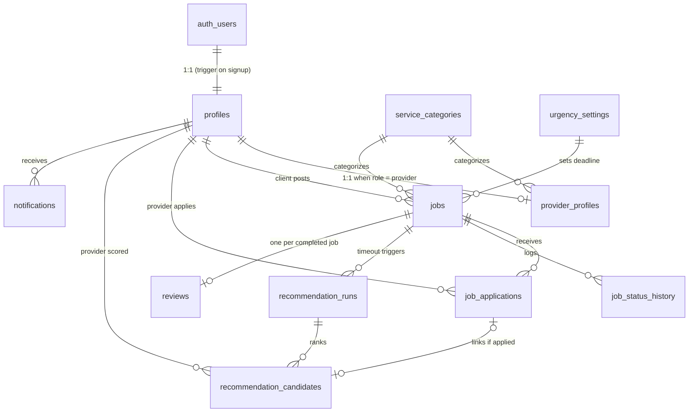

# TaskBuddy — Backend Data Schema Specification

> **Purpose of this document:** This is the authoritative data schema and recommendation-system
> specification for the TaskBuddy backend. It is written to be used directly as the prompt/basis
> for building the backend that serves the TaskBuddy **mobile app and website**.
> Follow it as the source of truth for table structure, naming, lifecycle rules, and
> ML-feature computation. Anything listed under *Out of Scope* must NOT be invented or added.

**Target platform:** Supabase (PostgreSQL 15+, Supabase Auth, Row Level Security, pg_cron)
**Companion service:** a small Python (FastAPI) service that hosts the trained scikit-learn
recommendation model (see [Recommendation Engine Integration](#9-recommendation-engine-integration)).

---

## Table of Contents

1. [Product Context](#1-product-context)
2. [The Matching Flow](#2-the-matching-flow)
3. [Schema Conventions](#3-schema-conventions)
4. [Enumerated Types](#4-enumerated-types)
5. [Tables (DDL)](#5-tables-ddl)
6. [Entity-Relationship Diagram](#6-entity-relationship-diagram)
7. [Job Lifecycle & Urgency Timeouts](#7-job-lifecycle--urgency-timeouts)
8. [ML Feature Mapping](#8-ml-feature-mapping)
9. [Recommendation Engine Integration](#9-recommendation-engine-integration)
10. [Triggers & Functions](#10-triggers--functions)
11. [Row Level Security Outline](#11-row-level-security-outline)
12. [Seed Data](#12-seed-data)
13. [Retraining Data Export](#13-retraining-data-export)
14. [Out of Scope](#14-out-of-scope)
15. [App-Support Subsystems (migration 0006)](#15-app-support-subsystems-migration-0006)
16. [Job Pricing, Scheduling & Photos (migration 0007)](#16-job-pricing-scheduling--photos-migration-0007)
17. [Provider Verification (migration 0008)](#17-provider-verification-migration-0008)
18. [Escrow & Disputes (migrations 0009-0010)](#18-escrow--disputes-migrations-0009-0010)
19. [Avatars & User Settings (migration 0011)](#19-avatars--user-settings-migration-0011)
20. [Push Notifications (migration 0012)](#20-push-notifications-migration-0012)
21. [Stripe Payments & Identity (migration 0013)](#21-stripe-payments--identity-migration-0013)
22. [Password Reset](#22-password-reset)
23. [Admin Console Follow-ups (migration 0014)](#23-admin-console-follow-ups-migration-0014)

---

## 1. Product Context

TaskBuddy is a Philippine home-services marketplace. **Clients** post jobs in five service
categories — Plumbing, Cleaning, Handyman, Manicure, Pedicure — and **providers** (freelance
service workers) apply to them. Job descriptions and provider bios are written in
Taglish (mixed Filipino/English).

The differentiating feature is an **ML recommendation engine**: a trained Random Forest
classifier (scikit-learn) that scores job–provider pairs by hiring likelihood. It was developed
and validated in the companion ML repository ("TaskBuddy ML"): winner = Random Forest with
`n_estimators=50, max_depth=10, max_features='sqrt', min_samples_split=5, class_weight='balanced'`,
0.8123 accuracy / 0.8827 ROC-AUC over 100 group-aware splits.

The model consumes **14 raw input features** per job–provider pair (listed in
[Section 8](#8-ml-feature-mapping)). All preprocessing (ordinal encoding, TF-IDF + SVD for the
two text features, scaling) happens **inside the persisted sklearn Pipeline** — the backend must
pass raw values with the exact column names and types shown in Section 8, never pre-encoded values.

This schema has two jobs:

1. **Serve the marketplace flow** (accounts, job posting, applications, hiring, reviews).
2. **Serve the recommendation system**: compute all 14 model features from live data at scoring
   time, and snapshot every scored candidate with its eventual outcome so production data
   accumulates as future retraining rows.

---

## 2. The Matching Flow

This is the exact product flow the schema must support:

1. A client posts a job (category, Taglish description, location, urgency level).
2. Providers browse open jobs and **apply organically**. The client may approve **exactly one**
   provider at any time.
3. If the job has no approved provider when its **urgency timeout** elapses
   (**urgent = 5 min, normal = 10 min, flexible = 15 min** after posting), the system triggers
   the **recommendation engine**:
   - The engine builds the eligible provider pool, computes the 14 features for each
     job–provider pair, scores them with the model, and stores the ranked results.
   - The **top-N providers (default N = 8)** each receive a notification inviting them to the job.
4. Recommended providers may then apply like any other applicant; the client still approves
   exactly one.
5. When the client approves an application, the job is assigned; it then progresses to
   completion, after which the client leaves a rating/review.

---

## 3. Schema Conventions

- **Primary keys:** `uuid` with `default gen_random_uuid()`, except small lookup/config tables.
- **Timestamps:** always `timestamptz`. Every table has `created_at timestamptz not null default now()`;
  mutable tables also have `updated_at` maintained by trigger.
- **Naming:** `snake_case` tables and columns; singular enum type names; `fk_`-free natural names.
- **Time zone:** business-facing time derivations (`hour_posted`, `day_of_week`) use `Asia/Manila`.
- **Locations:** plain `latitude double precision` / `longitude double precision` columns plus a
  haversine SQL function (Section 10). PostGIS is an optional upgrade, not required.
- **Category strings** stored in `service_categories.name` must exactly match the strings the
  model was trained on: `Plumbing`, `Cleaning`, `Handyman`, `Manicure`, `Pedicure` (case-sensitive).
- **User-generated text limits** — enforced by CHECK constraints in the DDL (characters), with
  the word figures as frontend form guidance. The two ML text features get both a floor and a
  cap: the TF-IDF pipeline was trained on short templated Taglish text, so near-empty text gives
  the model no signal and very long text dilutes it.

  | Column | Characters | ≈ Words | ML feature? |
  |---|---|---|---|
  | `jobs.title` | 5–120 | 1–15 | no |
  | `jobs.description` | 20–750 | 5–100 | **yes** (`job_description`) |
  | `provider_profiles.bio` | 20–400 | 5–60 | **yes** (`provider_bio`) |
  | `job_applications.cover_message` | ≤ 300 | ≤ 40 | no |
  | `reviews.comment` | ≤ 500 | ≤ 70 | no |

---

## 4. Enumerated Types

```sql
create type user_role          as enum ('client', 'provider');
create type job_urgency        as enum ('urgent', 'normal', 'flexible');
create type job_status         as enum ('open', 'recommending', 'assigned',
                                        'in_progress', 'completed', 'cancelled', 'expired');
create type application_status as enum ('pending', 'accepted', 'rejected', 'withdrawn');
create type application_source as enum ('organic', 'recommended');
create type recommendation_trigger as enum ('timeout', 'manual');
create type notification_type  as enum ('recommendation_invite', 'application_update', 'job_update');
```

> Note: the enum labels `urgent | normal | flexible` must match the model's training values
> for the `job_urgency` feature exactly (lowercase).

> **Later migrations extend two of these**, and the block above shows the original 0001 values only:
> `user_role` gains `'admin'` (0005); `notification_type` gains `'verification_update'` (0008),
> `'dispute_update'` (0009) and `'payment_update'` (0013). Migrations 0006, 0008, 0009, 0012 and
> 0013 also add their own enums —
> `wallet_txn_direction`, `wallet_txn_status`, `booking_status` (§15); `verification_status` (§17);
> `escrow_status`, `dispute_status`, `dispute_resolution` (§18); `wallet_txn_kind` (0010, §18);
> `device_platform` (§20); `verification_method` (§21).

---

## 5. Tables (DDL)

### 5.1 `profiles` — shared identity for both roles

One row per authenticated user, `id` = Supabase `auth.users.id`. Created automatically by
trigger on signup (Section 10).

```sql
create table profiles (
    id           uuid primary key references auth.users (id) on delete cascade,
    role         user_role not null,
    full_name    text not null,
    phone        text,
    avatar_url   text,                       -- Supabase Storage public URL
    address      text,
    city         text,
    latitude     double precision,           -- default location; jobs carry their own coords
    longitude    double precision,
    deactivated_at timestamptz,              -- soft delete / suspension
    created_at   timestamptz not null default now(),
    updated_at   timestamptz not null default now()
);
```

### 5.2 `service_categories` — lookup

```sql
create table service_categories (
    id         smallint generated always as identity primary key,
    name       text not null unique,         -- must match ML training strings exactly
    is_active  boolean not null default true,
    created_at timestamptz not null default now()
);
```

### 5.3 `provider_profiles` — provider-only attributes + cached ML stats

1:1 extension of `profiles` for `role = 'provider'`. The three `cached_*` columns are
denormalized aggregates maintained by triggers (Section 10) so recommendation scoring never
needs expensive on-the-fly aggregation.

```sql
create table provider_profiles (
    profile_id    uuid primary key references profiles (id) on delete cascade,
    category_id   smallint not null references service_categories (id),
    bio           text not null
                  check (char_length(bio) between 20 and 400),  -- Taglish self-description (ML feature: provider_bio)
    years_experience numeric(4,1) not null default 0,
    is_available  boolean not null default true, -- provider-controlled toggle (ML feature)
    service_radius_km numeric(5,1) not null default 15.0,
    cached_avg_rating        numeric(3,2),       -- null until first review
    cached_ratings_count     integer not null default 0,
    cached_completed_jobs    integer not null default 0,
    cached_avg_response_hrs  numeric(6,2),       -- null until first responded invite
    created_at    timestamptz not null default now(),
    updated_at    timestamptz not null default now()
);

create index idx_provider_profiles_category   on provider_profiles (category_id);
create index idx_provider_profiles_available  on provider_profiles (is_available) where is_available;
```

### 5.4 `urgency_settings` — recommendation timeout config

```sql
create table urgency_settings (
    urgency         job_urgency primary key,
    timeout_minutes integer not null check (timeout_minutes > 0)
);
```

Seeded with: `urgent = 5`, `normal = 10`, `flexible = 15` (Section 12).

### 5.5 `jobs`

```sql
create table jobs (
    id           uuid primary key default gen_random_uuid(),
    client_id    uuid not null references profiles (id),
    category_id  smallint not null references service_categories (id),
    title        text not null check (char_length(title) between 5 and 120),
    description  text not null
                 check (char_length(description) between 20 and 750),  -- Taglish (ML feature: job_description)
    urgency      job_urgency not null default 'normal',
    status       job_status not null default 'open',
    address      text not null,
    latitude     double precision not null,
    longitude    double precision not null,
    posted_at    timestamptz not null default now(),
    recommendation_deadline timestamptz not null,  -- set by trigger: posted_at + urgency timeout
    assigned_provider_id uuid references profiles (id),
    assigned_at  timestamptz,
    completed_at timestamptz,
    created_at   timestamptz not null default now(),
    updated_at   timestamptz not null default now(),
    constraint chk_assignment_consistency
        check (status not in ('assigned','in_progress','completed') or assigned_provider_id is not null)
);

create index idx_jobs_status_deadline on jobs (status, recommendation_deadline)
    where status = 'open';                    -- the timeout poller's index
create index idx_jobs_client   on jobs (client_id);
create index idx_jobs_category on jobs (category_id, status);
```

### 5.6 `job_status_history` — audit trail of lifecycle transitions

```sql
create table job_status_history (
    id         bigint generated always as identity primary key,
    job_id     uuid not null references jobs (id) on delete cascade,
    old_status job_status,
    new_status job_status not null,
    changed_by uuid references profiles (id),  -- null when system-initiated
    changed_at timestamptz not null default now()
);

create index idx_job_status_history_job on job_status_history (job_id, changed_at);
```

### 5.7 `job_applications`

```sql
create table job_applications (
    id          uuid primary key default gen_random_uuid(),
    job_id      uuid not null references jobs (id) on delete cascade,
    provider_id uuid not null references profiles (id),
    source      application_source not null default 'organic',
    status      application_status not null default 'pending',
    cover_message text check (char_length(cover_message) <= 300),
    applied_at  timestamptz not null default now(),
    decided_at  timestamptz,                  -- when client accepted/rejected
    created_at  timestamptz not null default now(),
    updated_at  timestamptz not null default now(),
    unique (job_id, provider_id)
);

-- Exactly ONE accepted application per job — the core marketplace invariant.
create unique index uq_job_applications_one_accepted
    on job_applications (job_id) where status = 'accepted';

create index idx_job_applications_provider on job_applications (provider_id, status);
```

### 5.8 `recommendation_runs` — one row per scoring event

```sql
create table recommendation_runs (
    id            uuid primary key default gen_random_uuid(),
    job_id        uuid not null references jobs (id) on delete cascade,
    triggered_by  recommendation_trigger not null default 'timeout',
    model_version text not null,              -- e.g. 'rf-a-v1' — set by the model service
    pool_size     integer not null,           -- eligible providers considered
    created_at    timestamptz not null default now()
);

create index idx_recommendation_runs_job on recommendation_runs (job_id);
```

### 5.9 `recommendation_candidates` — ranked results + frozen feature snapshot

This table is the heart of the recommendation system. Each row stores the model's output for
one job–provider pair **and the exact 14 feature values at scoring time** (column names match
the ML training dataset). `was_hired` is backfilled when the job closes, turning every row
into a labeled retraining example.

```sql
create table recommendation_candidates (
    id          uuid primary key default gen_random_uuid(),
    run_id      uuid not null references recommendation_runs (id) on delete cascade,
    provider_id uuid not null references profiles (id),
    rank        smallint not null,            -- 1 = best
    score       numeric(6,5) not null,        -- model probability of hire
    notified_at timestamptz,                  -- set when invite notification is created (top-N only)
    application_id uuid references job_applications (id),  -- set if the provider applied
    was_hired   boolean,                      -- backfilled at job completion/cancellation

    -- Frozen ML feature snapshot (names/types mirror the training CSV) --
    skills_match                smallint not null,          -- 0/1
    distance_km                 numeric(6,2) not null,
    provider_avg_rating         numeric(3,2) not null,
    provider_completed_jobs     integer not null,
    provider_availability       smallint not null,          -- 0/1
    job_idle_duration_hrs       numeric(8,2) not null,
    provider_response_time_hrs  numeric(6,2) not null,
    provider_years_experience   numeric(4,1) not null,
    hour_posted                 smallint not null,
    provider_skill_category     text not null,
    day_of_week                 text not null,
    job_urgency                 text not null,
    job_description             text not null,
    provider_bio                text not null,

    created_at  timestamptz not null default now(),
    unique (run_id, provider_id)
);

create index idx_recommendation_candidates_provider on recommendation_candidates (provider_id);
create index idx_recommendation_candidates_label
    on recommendation_candidates (was_hired) where was_hired is not null;
```

### 5.10 `reviews` — source of `provider_avg_rating`

One review per completed job, written by the job's client about the assigned provider.

```sql
create table reviews (
    id          uuid primary key default gen_random_uuid(),
    job_id      uuid not null unique references jobs (id) on delete cascade,
    client_id   uuid not null references profiles (id),
    provider_id uuid not null references profiles (id),
    rating      smallint not null check (rating between 1 and 5),
    comment     text check (char_length(comment) <= 500),
    created_at  timestamptz not null default now()
);

create index idx_reviews_provider on reviews (provider_id);
```

### 5.11 `notifications` — minimal, scoped to this flow

```sql
create table notifications (
    id           uuid primary key default gen_random_uuid(),
    recipient_id uuid not null references profiles (id) on delete cascade,
    type         notification_type not null,
    title        text not null,
    body         text not null,
    data         jsonb not null default '{}',  -- { "job_id": ..., "application_id": ... }
    read_at      timestamptz,
    created_at   timestamptz not null default now()
);

create index idx_notifications_recipient on notifications (recipient_id, read_at, created_at desc);
```

---

## 6. Entity-Relationship Diagram



---

## 7. Job Lifecycle & Urgency Timeouts

```
                    client approves an application
   open ────────────────────────────────────────────► assigned ──► in_progress ──► completed
    │                                                     ▲                            │
    │ recommendation_deadline passes                      │                            ▼
    │ with no accepted application                        │                     (review written)
    ▼                                                     │
 recommending ── top-N providers notified; they apply ────┘
    │
    │ no acceptance within 24 h of posting (tunable constant)
    ▼
 expired                    (client may cancel from any pre-completion state ──► cancelled)
```

Rules:

- `recommendation_deadline = posted_at + timeout_minutes(urgency)` from `urgency_settings`:
  **urgent = 5 min, normal = 10 min, flexible = 15 min**. Set by trigger on insert (Section 10).
- A pg_cron job runs **every minute** and transitions `open → recommending` for jobs past their
  deadline with no accepted application, then invokes the recommendation service (Section 9).
- The `open → recommending` transition happens at most once per job via the timeout path;
  additional runs are only possible with `triggered_by = 'manual'`.
- Accepting an application (from either an `open` or `recommending` job) sets
  `jobs.assigned_provider_id`, `assigned_at`, `status = 'assigned'`, and auto-rejects all other
  pending applications for that job.
- Every status change is recorded in `job_status_history` by trigger.
- On terminal states (`completed`, `cancelled`, `expired`), backfill
  `recommendation_candidates.was_hired` for all candidates of that job:
  `true` where the candidate's provider is the assigned provider of a completed job, else `false`.

---

## 8. ML Feature Mapping

The model service must receive, for each job–provider pair, a record with **exactly these
14 columns** (names and raw types as trained; the sklearn Pipeline does all encoding internally):

| # | Feature (exact column name) | Type | Live source |
|---|---|---|---|
| 1 | `skills_match` | int 0/1 | `provider_profiles.category_id = jobs.category_id` |
| 2 | `distance_km` | float | `haversine_km(jobs.latitude, jobs.longitude, profiles.latitude, profiles.longitude)` |
| 3 | `provider_avg_rating` | float | `provider_profiles.cached_avg_rating`; fallback **3.0** when null (new provider) |
| 4 | `provider_completed_jobs` | int | `provider_profiles.cached_completed_jobs` |
| 5 | `provider_availability` | int 0/1 | `provider_profiles.is_available` |
| 6 | `job_idle_duration_hrs` | float | `extract(epoch from (now() - jobs.posted_at)) / 3600` at scoring time |
| 7 | `provider_response_time_hrs` | float | `provider_profiles.cached_avg_response_hrs`; fallback **2.0** when null |
| 8 | `provider_years_experience` | float | `provider_profiles.years_experience` |
| 9 | `hour_posted` | int | `extract(hour from jobs.posted_at at time zone 'Asia/Manila')` |
| 10 | `provider_skill_category` | text | `service_categories.name` of the provider's category |
| 11 | `day_of_week` | text | `trim(to_char(jobs.posted_at at time zone 'Asia/Manila', 'Day'))` → `'Monday'`…`'Sunday'` |
| 12 | `job_urgency` | text | `jobs.urgency::text` (`'urgent' / 'normal' / 'flexible'`) |
| 13 | `job_description` | text | `jobs.description` |
| 14 | `provider_bio` | text | `provider_profiles.bio` |

Definitions the backend must implement:

- **`cached_avg_response_hrs`** = average of
  `extract(epoch from (application.applied_at - candidate.notified_at)) / 3600`
  over the provider's **last 20 responded recommendation invites**
  (rows in `recommendation_candidates` where `notified_at` and `application_id` are both set).
  Recomputed by trigger whenever such a link is created. Invites the provider ignored are
  excluded. New providers have `null` → the scoring query substitutes the fallback **2.0 h**.
- **Fallback values** (3.0 rating, 2.0 h response) are tunable constants; keep them in the model
  service's config, not hardcoded in SQL scattered across the codebase.
- **Eligible provider pool** for a scoring run: providers with `is_available = true`,
  `deactivated_at is null`, who have not already applied to the job, and whose category matches
  the job **or** whose distance to the job is within their `service_radius_km`. `pool_size` on
  `recommendation_runs` records how many were scored.

### Feature-vector SQL function

Implement a function the model service calls per scoring run:

```sql
create or replace function fn_job_provider_features(p_job_id uuid)
returns table (
    provider_id uuid,
    skills_match smallint,
    distance_km numeric,
    provider_avg_rating numeric,
    provider_completed_jobs integer,
    provider_availability smallint,
    job_idle_duration_hrs numeric,
    provider_response_time_hrs numeric,
    provider_years_experience numeric,
    hour_posted smallint,
    provider_skill_category text,
    day_of_week text,
    job_urgency text,
    job_description text,
    provider_bio text
)
language sql stable as $$
    select
        pp.profile_id,
        (pp.category_id = j.category_id)::int::smallint,
        round(haversine_km(j.latitude, j.longitude, pr.latitude, pr.longitude)::numeric, 2),
        coalesce(pp.cached_avg_rating, 3.0),
        pp.cached_completed_jobs,
        pp.is_available::int::smallint,
        round((extract(epoch from (now() - j.posted_at)) / 3600)::numeric, 2),
        coalesce(pp.cached_avg_response_hrs, 2.0),
        pp.years_experience,
        extract(hour from j.posted_at at time zone 'Asia/Manila')::smallint,
        sc.name,
        trim(to_char(j.posted_at at time zone 'Asia/Manila', 'Day')),
        j.urgency::text,
        j.description,
        pp.bio
    from jobs j
    cross join provider_profiles pp
    join profiles pr on pr.id = pp.profile_id
    join service_categories sc on sc.id = pp.category_id
    where j.id = p_job_id
      and pp.is_available
      and pr.deactivated_at is null
      and pr.latitude is not null and pr.longitude is not null  -- providers without a location can't be scored
      and not exists (select 1 from job_applications ja
                      where ja.job_id = j.id and ja.provider_id = pp.profile_id)
      and (pp.category_id = j.category_id
           or haversine_km(j.latitude, j.longitude, pr.latitude, pr.longitude)
              <= pp.service_radius_km);
$$;
```

---

## 9. Recommendation Engine Integration

Supabase Edge Functions run Deno, not Python, so the sklearn model lives in a **separate
Python FastAPI service** (deploy anywhere that runs Python: Railway/Render/Fly/VPS).

**Model artifact:** the ML repository (`TaskBuddy ML`) trains and evaluates but does not persist
a model file. The backend project must produce the artifact once:
fit the winning pipeline — the shared preprocessing `ColumnTransformer` (passthrough numerics,
`OrdinalEncoder` for the 3 categoricals, per-text-column `TfidfVectorizer(sublinear_tf=True)` →
`TruncatedSVD(n_components=20, random_state=42)`) followed by
`RandomForestClassifier(n_estimators=50, max_depth=10, max_features='sqrt',
min_samples_split=5, class_weight='balanced', random_state=42)` — on the **full**
`taskbuddy_synthetic_dataset.csv` (all 40,000 rows; evaluation is already done, so no rows need
holding out — just drop the `hire_probability` audit column), and save with `joblib.dump()`.
Version it (`rf-a-v1`).
Replace with a model retrained on real data once enough labeled rows accumulate (Section 13).

**Scoring flow (per timed-out job):**

1. pg_cron (every minute) finds `open` jobs past `recommendation_deadline` with no accepted
   application, sets them to `recommending`, and notifies the model service
   (HTTP call via `pg_net`, or the service polls a queue view — implementer's choice).
2. The service calls `fn_job_provider_features(job_id)` (via Supabase service-role key or a
   direct Postgres connection), runs `pipeline.predict_proba(df)[:, 1]`, and:
   - inserts one `recommendation_runs` row (`model_version`, `pool_size`);
   - inserts one `recommendation_candidates` row **per scored provider** (full feature snapshot),
     ranked by score;
   - sets `notified_at` and creates a `notifications` row (`type = 'recommendation_invite'`)
     for the **top N = 8** only.
3. When a provider who was a candidate applies, the backend links
   `recommendation_candidates.application_id` and sets `job_applications.source = 'recommended'`.

**Column order/name discipline:** build the scoring DataFrame directly from the function's
result set — the pipeline selects columns by name, so names must match Section 8 exactly.

---

## 10. Triggers & Functions

Implement these (standard PL/pgSQL; exact bodies are the implementer's choice unless shown):

| # | Trigger / function | Behavior |
|---|---|---|
| 1 | `handle_new_user()` on `auth.users` insert | Create the `profiles` row from signup metadata (`role`, `full_name`). Supabase-standard pattern. |
| 2 | `set_updated_at()` | `before update` on every table with `updated_at`. |
| 3 | `set_recommendation_deadline()` | `before insert` on `jobs`: `recommendation_deadline := posted_at + make_interval(mins => (select timeout_minutes from urgency_settings where urgency = new.urgency))`. |
| 4 | `log_job_status_change()` | `after update of status` on `jobs`: insert into `job_status_history`. |
| 5 | `handle_application_accepted()` | `after update` on `job_applications` when status becomes `accepted`: set job's `assigned_provider_id`, `assigned_at`, `status='assigned'`; auto-reject sibling `pending` applications (set `decided_at`). |
| 6 | `refresh_provider_rating()` | `after insert` on `reviews`: recompute `cached_avg_rating` and `cached_ratings_count` for the provider. |
| 7 | `refresh_provider_completed_jobs()` | `after update` on `jobs` when status becomes `completed`: increment the assigned provider's `cached_completed_jobs`; also backfill `was_hired` on all `recommendation_candidates` of this job. Backfill `was_hired=false` on `cancelled`/`expired` too. |
| 8 | `refresh_provider_response_time()` | `after update of application_id` on `recommendation_candidates`: recompute `cached_avg_response_hrs` over the provider's last 20 responded invites. |
| 9 | `haversine_km(lat1, lon1, lat2, lon2)` | Immutable SQL function: `6371 * acos(least(1.0, cos(radians(lat1))*cos(radians(lat2))*cos(radians(lon2)-radians(lon1)) + sin(radians(lat1))*sin(radians(lat2))))`. |

---

## 11. Row Level Security Outline

Enable RLS on **every** table. Policy intent (implementer writes the SQL):

| Table | Policy intent |
|---|---|
| `profiles` | Users read/update own row. Public read of `full_name`, `avatar_url`, `city` for marketplace display (or expose via a view). |
| `service_categories`, `urgency_settings` | Read for all authenticated users; write via service role only. |
| `provider_profiles` | Provider updates own row (`bio`, `is_available`, etc. — **not** the `cached_*` columns; restrict those to trigger/service role). Authenticated users can read (needed for job browsing/display). |
| `jobs` | Client full access to own jobs. Providers read jobs with status `open`/`recommending`, plus jobs they're assigned to. |
| `job_applications` | Provider inserts/reads/withdraws own applications. Client reads applications for own jobs and updates their status (accept/reject). |
| `recommendation_runs`, `recommendation_candidates` | **Service role only.** Never client-readable — feature snapshots include other providers' data and model scores. |
| `reviews` | Client inserts for own completed jobs (one per job, enforced by unique constraint). Read for all authenticated users. |
| `notifications` | Recipient reads/marks-read own rows; inserts via service role/triggers only. |
| `job_status_history` | Read own-job history (client) / assigned-job history (provider); insert via trigger only. |

Example policy (pattern to follow):

```sql
alter table jobs enable row level security;

create policy jobs_client_all on jobs
    for all using (client_id = auth.uid());

create policy jobs_provider_read on jobs
    for select using (
        status in ('open', 'recommending')
        or assigned_provider_id = auth.uid()
    );
```

---

## 12. Seed Data

```sql
insert into service_categories (name) values
    ('Plumbing'), ('Cleaning'), ('Handyman'), ('Manicure'), ('Pedicure');

insert into urgency_settings (urgency, timeout_minutes) values
    ('urgent', 5), ('normal', 10), ('flexible', 15);
```

---

## 13. Retraining Data Export

Every closed job yields labeled rows. Export in the exact training-CSV shape:

```sql
select
    rr.job_id,
    rc.provider_id,
    rc.skills_match,
    rc.distance_km,
    rc.provider_avg_rating,
    rc.provider_completed_jobs,
    rc.provider_availability,
    rc.job_idle_duration_hrs,
    rc.provider_response_time_hrs,
    rc.provider_years_experience,
    rc.hour_posted,
    rc.provider_skill_category,
    rc.day_of_week,
    rc.job_urgency,
    rc.job_description,
    rc.provider_bio,
    rc.was_hired::int as is_recommended
from recommendation_candidates rc
join recommendation_runs rr on rr.id = rc.run_id
where rc.was_hired is not null;
```

Retraining then reuses the ML repository's `run_training.py` methodology (GroupShuffleSplit by
`job_id` — critical, candidates of one job must never straddle the train/test boundary).

> Note for whoever retrains: production rows will all have `provider_availability = 1`, because
> the scoring pool only ever contains available providers (a deliberate product rule). The
> feature stays in the vector for compatibility with the trained pipeline, but it will carry no
> variance in production-collected data.

---

## 14. Out of Scope

Do **not** design or implement the following (deliberately deferred; adding them now would
bloat the schema beyond the validated recommendation flow):

- Provider portfolios and certifications
- Multi-category providers (one category per provider for now — matches the model)
- Push-notification delivery infrastructure (the `notifications` table is the source of truth;
  delivery transport is a later concern)

> **Scope note (migration 0006):** Wallet/payments, in-app chat, and scheduling/calendar were
> originally on this list. They have since been added — as ledger/chat/booking tables that back
> the mobile app's Wallet, Chat, and Calendar screens — and are documented in [Section 15](#15-app-support-subsystems-migration-0006).
> They are **not** part of the ML recommendation flow and feed no model features. Admin
> dashboard/moderation tables were likewise added later (migration 0005).

> **Scope note (migrations 0007–0009):** *Document verification* was also on this list and has
> since been added (§17), along with job pricing/scheduling/photos (§16) and escrow/disputes
> (§18). Like §15, none of these feed model features or the retraining export. The driver was
> the same in every case: the mobile and web UIs already collected or displayed this data and
> had nowhere to put it.

---

## 15. App-Support Subsystems (migration 0006)

These three subsystems exist to back the mobile app UI. They are intentionally lightweight and
**decoupled from the recommendation engine** — none of their columns are ML features, and no
retraining export reads them. RLS is enabled on every table (the NestJS API uses the service-role
key and enforces authorization in code; policies are defense-in-depth). Full DDL lives in
`supabase/migrations/0006_wallet_chat_calendar.sql`.

### 15.1 Wallet — `wallet_transactions`

A per-user ledger. **There is no real payment gateway**; entries are recorded directly and the
balance is *derived* (never stored): `sum(completed credits) − sum(completed debits)`. Enums:
`wallet_txn_direction ('credit','debit')`, `wallet_txn_status ('pending','completed','failed')`.
`amount` is always positive; `direction` carries the sign. An optional `job_id` links a payout /
hold / refund to the job that produced it. Migration 0010 adds a `kind` column — see §18; revenue
is `kind = 'payout'`, not merely "a credit with a job_id".

- `GET /wallet` → `{ balance, total_credited, total_debited, pending, transactions[] }`
- `POST /wallet/transactions` → record `{ direction, amount, title, job_id? }`

### 15.2 Chat — `conversations` + `messages`

One conversation per job, between its `client_id` and (assigned) `provider_id`. Created lazily the
first time either participant opens it — the job must already have an assigned provider. `messages`
carry `body` (1–1000 chars) and a `read_at`; a trigger keeps `conversations.last_message_at`
current for list ordering.

- `GET /conversations` → the caller's conversations (counterpart name + last-message time)
- `POST /conversations` → get-or-create for `{ job_id }`
- `GET /conversations/:id/messages` · `POST /conversations/:id/messages` `{ body }` · `POST /conversations/:id/read`

### 15.3 Calendar — `bookings`

A provider's scheduled bookings for assigned jobs. The base marketplace treats jobs as ASAP; a
booking adds an explicit `scheduled_at` + `duration_minutes` so the calendar has something to show.
Enum `booking_status ('scheduled','completed','cancelled')`. One booking per job.

- `GET /calendar/bookings?from=&to=` → the caller's bookings (provider or client side)
- `POST /calendar/bookings` 🔒(provider) → schedule an assigned job
- `PATCH /calendar/bookings/:id` 🔒(provider) → reschedule / update status / notes

---

## 16. Job Pricing, Scheduling & Photos (migration 0007)

The mobile job-creation flow always collected a budget, a preferred date/time, and photos, but
`submitJob()` dropped them — there were no columns. The web admin console's Bookings "Amount"
column was a hardcoded placeholder for the same reason. Three additive columns on `jobs`:

| Column | Type | Notes |
|---|---|---|
| `budget` | `numeric(12,2)` null, `> 0` | Client-set, in PHP. Null on every job posted before this migration. Seeds `escrow_transactions.amount` (§18). |
| `scheduled_at` | `timestamptz` null | Client's preferred start. Null = ASAP, the pre-existing behaviour. |
| `photo_urls` | `text[]` not null default `'{}'`, ≤ 6 | Storage object **paths** in the public `job-photos` bucket — not URLs, so the bucket can be re-pointed without rewriting rows. |

**No provider bidding.** Pricing is a single client-set budget; `job_applications` carries no
amount. This matches the mobile UI and keeps the ML flow's unpriced-application assumption intact.

**Auto-booking.** `handle_application_accepted()` (originally 0002) is replaced. It still assigns
the job and auto-rejects sibling applications, and now also inserts the `bookings` row when
`jobs.scheduled_at` is set, `on conflict (job_id) do nothing`. Before this, nothing in the product
ever created a booking, so the provider calendar was permanently empty.

**Uploads.** `POST /uploads/signed-url` returns a signed Storage upload URL; the device uploads
directly. Paths are generated server-side as `<profile id>/<uuid>.<ext>` and the API rejects any
submitted path that doesn't carry the caller's prefix.

---

## 17. Provider Verification (migration 0008)

Backs backlog stories #9 (provider submits ID + selfie) and #28 (admin review queue). Documents
live in the **private** `verification-docs` bucket; admins read them through short-lived signed
URLs generated by the API. These are government IDs — never make this bucket public.

`provider_verifications`: `id`, `provider_id`, `id_document_path`, `selfie_path`,
`status verification_status ('pending','approved','rejected')`, `submitted_at`, `reviewed_at`,
`reviewed_by`, `rejection_reason` (≤500), timestamps.

- Partial unique index on `(provider_id) where status = 'pending'` — a provider may resubmit
  after a rejection, but only one review can be open at a time.
- `provider_profiles.is_verified` flips on approval.

**`is_verified` is a badge, not a gate.** Applying to jobs is deliberately not restricted by it;
enforcing it would lock out every provider who signed up before verification existed. Revisit only
as an explicit product decision.

---

## 18. Escrow & Disputes (migrations 0009-0010)

`wallet_transactions` (§15.1) is a one-party ledger. The admin Transactions page needs the
opposite — a two-party record with escrow and dispute states — and the mobile dispute screen had
no backend at all. Backlog stories #17, #18, #20.

`escrow_transactions`: `id`, `job_id` (unique), `client_id`, `provider_id`, `amount numeric(12,2)`,
`status escrow_status ('held','released','disputed','refunded','cancelled')`, `held_at`,
`released_at`, `refunded_at`, timestamps.

`disputes`: `id`, `escrow_id`, `job_id`, `raised_by`, `reason` (1–200), `details` (≤1000),
`status dispute_status ('open','resolved','cancelled')`,
`resolution dispute_resolution ('released_to_provider','refunded_to_client')`, `resolution_note`,
`resolved_by`, `resolved_at`, timestamps. A CHECK keeps `status`/`resolution` consistent, and a
partial unique index on `(escrow_id) where status = 'open'` allows only one live dispute.

### Lifecycle

| Event | Escrow | Wallet movement |
|---|---|---|
| Application accepted, `jobs.budget` not null | → `held` | client **debit** (`escrow_hold`) |
| Job completed | → `released` | provider **credit** (`payout`) |
| Job cancelled | → `cancelled` | client **credit** (`refund`) |
| Client raises a dispute | → `disputed` | none — funds frozen |
| Admin resolves `released_to_provider` | → `released` | provider **credit** (`payout`) |
| Admin resolves `refunded_to_client` | → `refunded` | client **credit** (`refund`) |

Jobs with no budget get no escrow, and every step above no-ops for them.

### Funding a hold

You cannot hold money that isn't there. `POST /applications/:id/accept` therefore fails with
**400 `Insufficient wallet balance`** when the client's derived balance is below the job budget —
the job stays `open` and nobody is hired. Clients add funds through
`POST /wallet/transactions` (`direction: 'credit'`), which is what mobile's Add Money button does.

There is still no payment gateway: the ledger is the only account of record, and a top-up is
simply a recorded credit.

### `wallet_transactions.kind` — why direction isn't enough

A payout and a refund are **both credits carrying a `job_id`**. The pre-0010 revenue query
(`direction = 'credit' AND job_id IS NOT NULL`) would have counted refunds as revenue, inflating
the admin dashboard by the value of every cancelled or disputed job.

So every ledger row now carries a `wallet_txn_kind`, and **platform revenue is defined as
`kind = 'payout'`** and nothing else. The migration backfills existing job-linked credits to
`'payout'`, which is exactly what the old query counted — so revenue figures carry over unchanged.

`kind` is derived server-side and never accepted from a request body: a caller able to set
`kind = 'payout'` could inflate reported revenue just by topping up. `POST /wallet/transactions`
only ever produces `topup` or `withdrawal`; `payout`, `refund` and `escrow_hold` are written
exclusively by `EscrowService`.

### Known limitation

The balance check and the debit are two separate statements, not one transaction. Two concurrent
accepts for the same client could both pass the check and overdraw. In practice a client accepting
two jobs in the same instant is vanishingly rare, and the per-job `unique (job_id)` on
`escrow_transactions` still prevents double-holding a single job. Closing it properly means moving
hold into a SQL function with `select ... for update` — worth doing if real money is ever involved.

---

## 19. Avatars & User Settings (migration 0011)

Two gaps mobile/README.md lists under "What's Not Wired Yet".

### `avatars` Storage bucket

`profiles.avatar_url` has existed since 0001, but no bucket was registered for it, so the API
would not issue an upload URL and the app's "Change Photo" button had nowhere to put the file.
The bucket is **public**, like `job-photos` and unlike `verification-docs`: an avatar appears on
every job card and chat header, and signing each one would cost a round-trip per row.

`PATCH /profiles/me` accepts either shape in `avatar_url` and normalises both:

| Sent | Stored |
|------|--------|
| `u1/9f3c….jpg` (Storage path from `POST /uploads/signed-url`) | the bucket's public URL |
| `https://lh3.googleusercontent.com/…` (what Google sign-in supplies) | unchanged |
| `""` | `NULL` |

Paths are ownership-checked before conversion, and plaintext `http://` is rejected — otherwise a
profile could beacon every viewer to a third-party server.

### `user_settings`

One row per profile, holding the Settings screen's five toggles: `push_enabled`, `email_enabled`,
`sms_enabled`, `location_sharing`, `dark_mode`.

**A missing row means "all defaults", not "no settings".** Most users never open the screen, so
`GET /settings` creates the row on first read with no columns beyond the key — the DDL defaults
are the single definition of what a default is. `PATCH /settings` upserts, so the first
interaction can be a toggle rather than a read.

Only `push_enabled` is enforced today (§20). The email and SMS flags are stored so the screen
round-trips honestly; no transport reads them yet.

**Endpoints:** `GET /settings`, `PATCH /settings`

---

## 20. Push Notifications (migration 0012)

Before this, `notifications` *was* the notification system: rows written by triggers and services,
polled by the app. mobile/README.md: "The backend has no push-notification transport."

### `device_tokens`

Expo push tokens, **unique on `token`, not per profile**. Reinstalling or signing in as someone
else on the same handset produces the same token, and the row must follow the current owner
rather than leaving the previous account receiving that phone's notifications. `POST /devices`
upserts on it, which is what performs the handover.

Expo rather than FCM/APNs directly: the app ships through Expo Go and EAS builds, so Expo tokens
are what a device can produce, and going direct would mean provisioning an APNs key and an FCM
server key for a project that has neither.

### Delivery

`notifications.pushed_at` marks a row as handed to the transport. `NULL` means pending, indexed
with a partial index so the scan stays proportional to the backlog rather than to a table that
only ever grows.

`PushScheduler` sweeps every 30 s — an in-process `@Cron`, consistent with
`RecommendationsScheduler` and for the same reason (no pg_cron/pg_net in this project). A sweep
is used rather than a call at each write site because rows come from DB triggers as well as
services, and a trigger has no API request to hang a push off.

Each tick **claims before sending** (stamps `pushed_at`, then delivers), mirroring the status flip
in `RecommendationsScheduler`. The trade is asymmetric: claiming first can drop a *banner* if the
send then fails, while sending first can re-push the whole backlog if the stamp fails. Either way
the row survives — the app reads notifications from the table, not from the push.

Recipients who set `push_enabled = false` are filtered out; a user with no settings row counts as
opted in (§19). Tokens Expo rejects as `DeviceNotRegistered` are deleted — they are permanently
undeliverable and would otherwise waste a slot in every future batch.

Delivery is **best-effort**. `notifications` remains the source of truth; a push that never
arrives costs a banner, never a record.

**Endpoints:** `POST /devices`, `DELETE /devices/:token`

**Env:** `EXPO_ACCESS_TOKEN` (optional — only needed once push security is enabled on the Expo project)

### Realtime chat

`GET /conversations/:id/stream` is a Server-Sent Events feed of one conversation, emitting
`message` events carrying a full message row plus periodic `ping` events that stop proxies
reaping the connection as idle. `?since=<created_at>` resumes from the client's newest message.

SSE rather than Supabase Realtime because of a rule the app holds to — the device talks to this
API and nothing else. Realtime would mean shipping Supabase credentials to the client and giving
it a second, RLS-governed path to the same rows.

Underneath it is still polling, just moved off the device (where each tick cost a screen-wake and
a cold-start-prone round trip) onto an already-warm connection. Authentication is the usual
`Authorization` header, so a browser's built-in `EventSource` cannot open it; the app needs a
client that sends headers.

---

## 21. Stripe Payments & Identity (migration 0013)

§18 says the wallet ledger is the only account of record and there is no payment gateway. The
first half stays true — balances are still derived from `wallet_transactions` and nothing else —
but **topping up stops being an unbacked insert the client asks for**. A `topup` row now exists
only because Stripe said, on its own webhook, that money moved.

### Funding flow

```
App  →  POST /payments/topup { amount }
          Backend  →  creates (or reuses) a Stripe Customer      → profiles.stripe_customer_id
                   →  ephemeral key + PaymentIntent(metadata: profile_id, purpose)
App  →  presents PaymentSheet with those parameters
          Stripe  →  POST /payments/webhook  payment_intent.succeeded
            Backend  →  inserts wallet_transactions (kind 'topup', stripe_payment_intent_id)
                     →  inserts a 'payment_update' notification
```

**The wallet is never credited by the request that opens the sheet.** A PaymentIntent means the
user opened it, nothing more; a client that reported its own success could mint balance, and
balance buys labour through escrow. `kind` is `'topup'`, set server-side — the same rule §18
states, since a row tagged `'payout'` would register as platform revenue.

### Idempotency

Stripe retries until it gets a 2xx, so every handler must be safely repeatable. Two mechanisms:

- `wallet_transactions.stripe_payment_intent_id` is **partial-unique**. A redelivered
  `payment_intent.succeeded` collides on insert, and that collision *is* the check — it is logged
  and swallowed, not raised.
- `stripe_events` records every event id already processed, for handlers with no natural unique
  column to collide on.

**Events are recorded after the work, never before.** A crash in between means Stripe retries and
the work is redone — safe, by the two mechanisms above. Recording first would make the opposite
failure — work never done, event marked handled — permanent and silent.

A real (non-collision) failure is raised, producing a non-2xx so Stripe retries: money reached us
and the ledger row is not optional.

### Webhook authentication

`POST /payments/webhook` has no JWT — Stripe has no session. It is authenticated by the signature
over the **raw** request body, which is why `main.ts` sets `rawBody: true`; a body that has been
through `JSON.parse` and re-encoded will not match. Without that check the endpoint is an
unauthenticated "credit my wallet" API.

### Stripe Identity

A second route to a verified badge alongside the manual ID + selfie queue from §17. Documents go
to Stripe and never reach us — this server stops holding government IDs for providers who take
this route, and the decision arrives by webhook instead of waiting on an admin.

`provider_verifications` gains `method` (`'manual' | 'stripe_identity'`) and `stripe_session_id`.
The document paths become nullable, with a CHECK keeping the manual route as strict as it was:
a `'manual'` row still cannot exist without both paths. `uq_provider_verifications_one_pending`
continues to allow only one open review per provider, whichever route it came in by.

`identity.verification_session.verified` approves and sets `provider_profiles.is_verified`;
`requires_input` is treated as a rejection carrying Stripe's reason, so the provider's status
screen stops saying "under review". `reviewed_by` is `NULL` on these rows — no admin made the call.

**Endpoints:** `POST /payments/config`, `POST /payments/topup`, `POST /payments/webhook`,
`POST /verifications/identity-session`

**Env:** `STRIPE_SECRET_KEY`, `STRIPE_PUBLISHABLE_KEY`, `STRIPE_WEBHOOK_SECRET`,
`STRIPE_MOBILE_API_VERSION` (optional)

Missing Stripe config warns at boot and returns **503** at the point of use, matching the Google
OAuth pattern — a developer working on jobs or chat has no reason to hold Stripe keys.

Setup: [`docs/stripe-setup.md`](../docs/stripe-setup.md).

---

## 22. Password Reset

`ForgotPasswordScreen` was UI-only: mobile/README.md, "no backend reset endpoint yet".

Reset is a **code**, not a link. The default Supabase recovery email sends a link, which lands in
the phone's browser rather than the app and is useless to a React Native client with no deep-link
handler for it. The template must be changed to emit `{{ .Token }}` — see
[`docs/password-reset-setup.md`](../docs/password-reset-setup.md).

```
POST /auth/forgot-password { email }             → { success: true }, always
POST /auth/reset-password  { email, token, new_password } → { session }
```

`forgot-password` **always** reports success, including for an address with no account. Returning
404 for unknown emails would make it a membership oracle anyone could enumerate; real failures
(Supabase's hourly email cap, SMTP misconfiguration) are logged server-side instead, since the
caller must not be able to tell those apart either.

`reset-password` verifies the code first — that is what authenticates the request, since only the
mailbox holder can produce it, and Supabase enforces single use and expiry. Suspended accounts are
rejected here as they are at login: otherwise a reset is a way back into an account an admin
closed. The session is returned so the app can land the user signed in rather than bouncing them
to Login with a password they just typed twice.

---

## 23. Admin Console Follow-ups (migration 0014)

web/README.md "What's Still Needed From the Backend" listed seven gaps the admin console UI was
already built for but had no API behind. This section documents all seven; only the first and
fifth needed schema (`supabase/migrations/0014_admin_console_followups.sql`) — the rest reuse
existing tables.

### 23.1 Timed suspensions with a reason

`profiles` gains `suspended_until timestamptz` (null = indefinite) and `suspension_reason text`
(≤ 500 chars, nullable — suspensions predating this column have none). `admin_user_overview`
(§5.1, 0005) now selects both.

```
POST /admin/users/:id/suspend { duration_days?: number, reason: string } → profile row
```

Expiry is checked lazily wherever `deactivated_at` already gates access (`AuthService.login`,
`resetPassword`, `handleGoogleCallback`) rather than by a cron job: if `suspended_until` is in the
past, the three suspension columns are cleared and the request proceeds as if never suspended. A
still-active suspension behaves exactly as before (403, session signed out).

### 23.2 Admin-triggered password reset

```
POST /admin/users/:id/send-password-reset → { sent: true }
```

A thin wrapper over `supabase.anon.auth.resetPasswordForEmail` — the same primitive
`POST /auth/forgot-password` (§22) already uses, just admin-initiated instead of self-service.
Refuses `role = 'admin'` targets, matching `suspend`.

### 23.3 Booking detail endpoint

```
GET /admin/bookings/:id → { ...job, escrow: EscrowRow | null }
```

The list endpoint's row shape (`jobs.*` + category + client/provider names) already carries
`description`, `address`, `scheduled_at`, and `photo_urls` — the "detail" gap was really that the
console had no way to fetch **one** job by id as an admin, plus its escrow record if one exists.

### 23.4 Activity log pagination and date filtering

```
GET /admin/activity?limit=&offset=&from=&to= → { items: [...], total }
```

Breaking shape change from a bare array (was hardcoded to the newest 20 rows). `from`/`to` filter
on `job_status_history.changed_at`.

### 23.5 Real admin audit log

New table `admin_actions (id, actor_id, action, target_type, target_id, metadata jsonb,
created_at)` — service-role only (§11 treatment), queried through the API rather than read
directly. Distinct from `job_status_history` (§5.6), which audits job lifecycle transitions, not
the admin behind a moderation decision.

Written by: `AdminService.suspend/reinstate/cancelBooking`, `VerificationsService.approve/reject`,
`DisputesService.resolve`. `action` values are `<domain>.<verb>` (e.g. `user.suspend`,
`verification.approve`, `dispute.resolve`); `target_type` matches the affected table name.

```
GET /admin/audit?action=&actor_id=&from=&to=&limit=&offset= → { actions: [...], total }
```

### 23.6 Admin read-only access to a job's chat

```
GET /admin/jobs/:jobId/conversation → { messages: [{ ...message, sender_name }] }
```

Reuses `conversations`/`messages` (§15.2, 0006) with no new write path — an admin can never post
into a user conversation. A job with no conversation yet (no assigned provider, or one assigned
but chat never opened) returns an empty `messages` array rather than 404.

### 23.7 Verification submission pre-check

`POST /verifications` now rejects an `id_document_path`/`selfie_path` that doesn't resolve to a
non-empty image object in the `verification-docs` bucket, via `UploadsService.assertValidImage`
(a `storage.list()` metadata check — size and `mimetype`, not a full decode) before the row is
inserted. This is a usability guard, not identity verification: it exists so a provider whose
upload silently failed learns immediately instead of waiting for a manual rejection.
